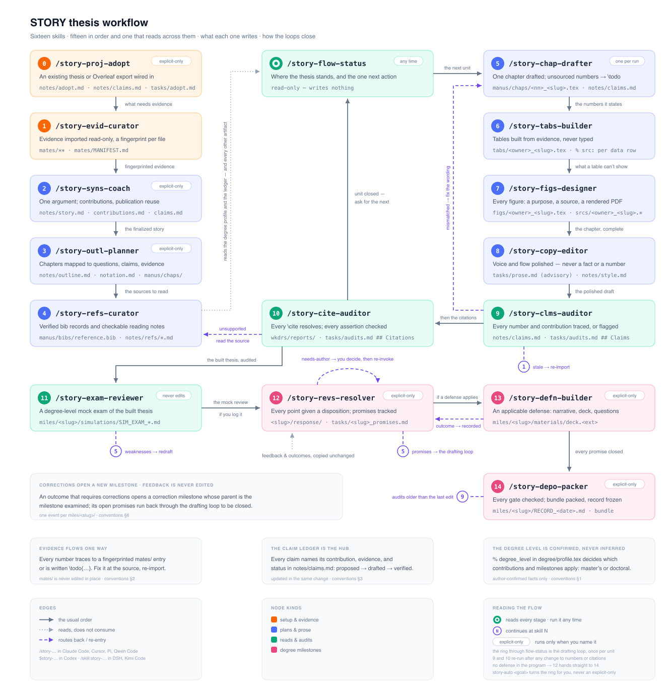

<div align="center">
  
  <h1>STORY</h1>
  <p><strong>Systematic Toolchain for Organizing Research over Years</strong></p>
  <p><em>A STAR takes the STAGE to tell a STORY.</em></p>
  <p><a href="https://wanghao9610.github.io/STORY/"><strong>文档网站</strong></a></p>
</div>

**语言：** [English](README.md) | 简体中文

STORY 把多年的研究生阶段研究组织成一部连贯、可答辩、可归档的硕士学位论文或博士学位论文。它把手稿、研究证据、出版物复用、学位要求、章节计划、贡献与论断记录、委员会反馈、答辩材料、修改过程及归档历史放在可预测的位置。研究者和 AI 写作 agent 依据同一套由仓库拥有的指令协作，因此即使一次对话早已结束，学位论文仍可在后续会话中继续推进并接受复核。

这套系统的核心契约是来源可追溯。论文中的每项定量或比较性陈述，都必须追溯到 `mates/` 下带指纹的文件，否则就以 `\todo{...}` 显式保留为未解决项；关于引用文献的每项断言，都必须能由阅读笔记或已导入材料核验；每项学位贡献都要记录对应的证据、章节、出版物和归属边界。因此，STORY 把学位论文视为对研究的综合，而不是把若干论文简单拼接在一起。

STORY 有两层：本仓库是**模板**；一部学位论文对应一个**实例**，可以克隆模板创建，也可以用 `execs/update.sh --adopt` 把骨架装入已有学位论文仓库。一个实例可以导入任意数量的 [STAR](https://github.com/wanghao9610/STAR) 研究仓库、[STAGE](https://github.com/wanghao9610/STAGE) 论文仓库、其他 STORY 学位论文仓库和人工登记来源。这种配套关系并非强制——STORY 也可以作为独立的学位论文仓库使用。

## 目录

- [目录](#目录)
- [STAR · STAGE · STORY](#star-·-stage-·-story)
- [STORY 提供什么](#story-提供什么)
- [项目结构](#项目结构)
- [学位论文模板](#学位论文模板)
  - [英文与简体中文](#英文与简体中文)
  - [学位档案与学校格式](#学位档案与学校格式)
- [快速开始](#快速开始)
  - [1. 创建学位论文仓库](#1-创建学位论文仓库)
  - [1b. 或者接入已有学位论文仓库](#1b-或者接入已有学位论文仓库)
  - [2. 配置本地运行环境和学位档案](#2-配置本地运行环境和学位档案)
  - [3. 路径 A：导入已有研究](#3-路径-a导入已有研究)
  - [4. 路径 B：登记独立证据](#4-路径-b登记独立证据)
  - [5. 构建与检查](#5-构建与检查)
  - [6. 启动学位论文工作流](#6-启动学位论文工作流)
- [写作工作流](#写作工作流)
- [从研究到归档的路径](#从研究到归档的路径)
- [证据、归属与论断记录表](#证据归属与论断记录表)
- [学位里程碑](#学位里程碑)
- [Agent harness](#agent-harness)
  - [Hook 与权限](#hook-与权限)
- [项目记忆](#项目记忆)
- [更新 STORY 的 skill 与工作流文档](#更新-story-的-skill-与工作流文档)
- [项目约定](#项目约定)
- [把 STORY 适配到实际学位论文](#把-story-适配到实际学位论文)
- [环境要求](#环境要求)
- [更新日志](#更新日志)
- [许可证](#许可证)

## STAR · STAGE · STORY

三个项目覆盖研究者工作中相继递进的尺度。它们可以各自独立使用，也可以通过带指纹的证据彼此衔接。

| 项目 | 范围 | 链接 |
| --- | --- | --- |
| **STAR** — Systematic Toolchain for AI Research | 推进一个研究项目：从想法出发，经可复现实验，产出可直接用于论文的证据。 | [官网](https://wanghao9610.github.io/STAR/) · [GitHub](https://github.com/wanghao9610/STAR) |
| **STAGE** — Systematic Toolchain for Authoring, Guiding, and Editing | 把一项研究贡献写成可追溯的论文，贯穿评审、回复与投稿打包。 | [官网](https://wanghao9610.github.io/STAGE/) · [GitHub](https://github.com/wanghao9610/STAGE) |
| **STORY** — Systematic Toolchain for Organizing Research over Years | 把研究生阶段的研究组织成可答辩、可归档的硕士或博士学位论文。 | **当前项目** · [官网](https://wanghao9610.github.io/STORY/) · [GitHub](https://github.com/wanghao9610/STORY) |

三者之间的交接是单向且可审计的：STAR 产出研究记录与实验结果；STAGE 把一项贡献写成论文并保存其评审历史；STORY 把相关材料快照为只读证据，并在学位尺度上进行综合。上游数值有误时，应在来源处修正后重新导入，绝不能直接修改快照。

## STORY 提供什么

- **完整的学位论文工作区**：前置部分、章节、附录、图、表、参考文献、学校记录、里程碑和持久化待办各归其位。
- **通用且可构建的 LaTeX 模板**：同时支持英文与简体中文的硕士、博士学位论文，把可复用 class、写作宏和参考文献样式与论文内容分离。
- **带指纹的证据层**：`mates/` 可以从多个 STAR、STAGE、STORY 或结构化通用仓库导入指定材料，并保留来源路径、commit、导入日期和 SHA-256 指纹。
- **学位论文层面的事实源**：`notes/` 下的中心论点、研究主线、贡献映射、出版与复用映射、章节结构、符号表、风格、阅读笔记和论断记录表由各自负责的工作流按需创建。
- **学位层级感知标准**：`degree/profile.tex` 选择 `master` 或 `doctoral`；该事实未知时，层级相关的综合、评审、答辩和归档关口不会启用。
- **学校事实与猜测分离**：正式要求、标题页措辞、委员会记录、模板、限制、批准和截止日期只能来自作者确认过的来源，并放在 `degree/` 与 `miles/` 下。
- **由十六个 skill 覆盖完整生命周期**：接入、证据整理、综合、提纲、章节起草、图、表、参考文献、文字润色、审计、模拟评审、反馈处理、答辩、归档和状态汇报。
- **确定性的构建与检查**：`execs/run.sh` 在源目录外构建；`lint.sh` 检查引用、todo、学位档案一致性、页数限制和格式；`fmt.sh` 让英文正文保持一句一行；`import.sh --diff` 检测证据漂移。
- **七个 agent harness 共用一套工作流**：Codex、Claude Code、Cursor、DeepSeek Harness、Kimi Code、Pi 与 Qwen Code 共享中立 skill 和请求分流器。
- **属于项目的跨会话记忆**：`.story/memory/` 保存那些没有被证据、学位档案、笔记、里程碑或任务文件认领的持久知识。
- **用英文或简体中文回复并撰写笔记**：`STORY_LANG` 决定一次运行用哪种语言回复和写作；README 与 skill 指南同时提供英文和简体中文版，而路径、ID、状态、命令和机器可读字段始终保持英文稳定值。

[写作工作流](#写作工作流)列出每个 skill 的职责与产物；[STORY 工作流 Skill 指南](docs/mds/story-workflow/writing-workflow-skills.zh-CN.md)给出紧凑流程图；[写作工作流规范](docs/mds/story-workflow/writing-workflow-conventions.md)（英文）定义所有 skill 共同遵守的证据、学位、里程碑、语言与验证契约。

## 项目结构

```text
STORY/
├── manus/                         # 学位论文源文件
│   ├── main.tex                   # 英文入口
│   ├── main-zh.tex                # 可构建的简体中文起始模板
│   ├── fronts/                    # 摘要、致谢、声明等前置部分
│   ├── chaps/                     # 编号章节：<nn>_<slug>.tex
│   ├── backs/                     # 附录等后置部分：<letter>_<slug>.tex
│   ├── figs/                      # 图文件 <owner>_<slug>.tex；figs/srcs/ 保存 PDF 与可编辑源文件
│   ├── tabs/                      # 有证据支持的 LaTeX 表格：<owner>_<slug>.tex
│   ├── bibs/                      # reference.bib（首次使用时创建）
│   └── stys/                      # story.cls、story.sty、story.bst
├── mates/                         # 导入的证据快照，只读
│   ├── <source-slug>/             # 一个具有独立命名空间的来源仓库
│   ├── manual/                    # 人工提供的研究材料
│   └── MANIFEST.md                # 来源与 SHA-256 台账
├── degree/                        # 经作者确认的学校事实
│   ├── profile.tex                # 学位层级、论文语言、标题页元数据
│   ├── requirements.md            # 带来源的学位与归档检查表
│   └── committee.md               # 经确认的导师与委员会记录
├── notes/                         # 学位论文叙事与写作元数据
│   ├── story.md                   # 中心论点与学位研究主线
│   ├── contributions.md           # 贡献 → 证据/出版物/章节
│   ├── publications.md            # 作者署名、复用、许可、重叠
│   ├── outline.md                 # 章节简报与视觉计划
│   ├── claims.md                  # 论断记录表
│   ├── notation.md                # 全文符号约定
│   ├── style.md                   # 可衡量的文字风格约定
│   └── refs/                      # 阅读笔记与参考文献索引
├── miles/                         # 开题、考核、外审、答辩、归档
│   └── <slug>/                    # milestone.yml、feedback/、simulations/、response/、materials/、template/、RECORD_*.md
├── tasks/                         # 持久化未解决工作与反馈承诺
├── wkdrs/                         # 构建产物和可再生成报告，git 忽略
├── execs/
│   ├── run.sh                     # 学位论文构建入口
│   ├── update.sh                  # 同步上游工作流；--adopt 安装骨架
│   └── scpts/                     # import.sh、lint.sh、fmt.sh
├── docs/                          # 文档网站与工作流指南
├── .story/memory/                 # 项目记忆；local/ 被 git 忽略
├── .agents/                       # 中立 skill、共享 /story 分流器与 /story-auto 流程
├── .codex/                        # Codex hook、manifest 与 $story / $story-auto 插件
├── .claude/ .cursor/ .dsh/        # 各 harness 的入口与 hook
├── .kimi-code/ .pi/ .qwen/        # 各 harness 的入口与 hook
├── .env.example                   # 本地配置示例
├── AGENTS.md                      # AI 写作 agent 的共享规则
└── README.md
```

这些缩写目录沿用 STAR 与 STAGE 的约定：

| 目录 | 全称 | 内容 |
| --- | --- | --- |
| `manus/` | Manuscript | 学位论文的 LaTeX 源文件 |
| `fronts/` | Front matter | 摘要、致谢、声明等前置材料 |
| `chaps/` | Chapters | 每章一个 `<nn>_<slug>.tex` 文件，按大纲顺序编键 |
| `backs/` | Back matter | 正文章节后的附录及其他材料，`<letter>_<slug>.tex` |
| `figs/` | Figures | 图文件 `<owner>_<slug>.tex`；`srcs/` 保存成图与可编辑源文件（PDF、PPTX 等） |
| `tabs/` | Tables | 有证据支持的表格 `<owner>_<slug>.tex` |
| `bibs/` | Bibliographies | 学位论文参考文献 |
| `stys/` | Styles | 可复用 class、package 与参考文献样式 |
| `mates/` | Materials | 带指纹的只读证据快照 |
| `miles/` | Milestones | 每次开题、考核、答辩、修改轮或归档尝试一个目录 |
| `execs/` | Executions | 构建与更新入口；`scpts/` 保存工具脚本 |
| `wkdrs/` | Work directories | 构建产物与临时报告，不是持久项目状态 |
| `mds/` | Markdowns | 按主题组织的 Markdown 文档 |
| `srcs/` | Static sources | 文档图片与可编辑视觉源文件 |

`chaps/`、`backs/`、`figs/`、`figs/srcs/` 与 `tabs/` 下的文件一律命名为 `<key>_<slug>.<ext>`：只有一个下划线，其后是小写 slug，词与词之间用 `-` 连接，中文对照版以 `-zh` 结尾。章节的键是两位数编号，附录的键是字母；图文件、其成图或源文件与表格取 `<owner>`，即引用它的那一个章节或附录文件的键（前置部分用 `00`，保留一位数章节键的论文用 `0`），自身不带序号；`fronts/` 保持无前缀。这样命名后，同一目录在 git 与终端中的排列顺序与在 VS Code、Overleaf、Finder 中一致；文件名不合该方案时，`lint.sh` 会发出警告（[规约 §5](docs/mds/story-workflow/writing-workflow-conventions.md#manuscript-file-names)，英文）。

有三条规则比目录名称更重要。`mates/` 除 `execs/scpts/import.sh` 与 `story-evid-curator` 外一律只读；`wkdrs/` 可以重新生成，因此持久结果应写入 `notes/`、`miles/` 或 `tasks/`；新克隆有意只包含 `notes/.gitkeep` 与 `notes/refs/.gitkeep`。各工作流在第一次使用时创建自己拥有的 `notes/*.md`——文件缺席表示“尚未初始化”，而不是“模板里缺了它”。

## 学位论文模板

模板把可复用排版、作者拥有的内容和学校事实分成不同层：

| 层 | 文件 | 负责内容 |
| --- | --- | --- |
| 学位论文入口 | `manus/main.tex` 或 `manus/main-zh.tex` | 前置/章节/后置顺序、全文宏、参考文献启用 |
| 外观层 | `manus/stys/story.cls` | book 布局、页面尺寸、标题页、标题、本地化、链接与引用 |
| 写作层 | `manus/stys/story.sty` | 章节和表格使用的 `\todo`、交叉引用辅助、表格列与写作宏 |
| 参考文献样式 | `manus/stys/story.bst` | 参考文献条目的排版方式 |
| 学位事实 | `degree/profile.tex` | 学位层级、论文语言、正式标题页字段、经确认页数上限 |

项目专属命令，例如 `\newcommand{\method}{...}`，应写在入口文件中，而不是写入 `story.cls` 或 `story.sty`。这种分层便于审查学校格式适配；实例拥有整个 `manus/` 树，`execs/update.sh` 永远不会替换它。

class 接受常规 `book` 选项，以及 `draft|final`、`en|english|zh|chinese` 与 `cjk`。默认模式是英文草稿。英文入口使用 `\documentclass[oneside]{stys/story}`；中文起始模板使用 `\documentclass[oneside,zh]{stys/story}`，并包含 `% !TeX program = xelatex` 指令。`cjk` 让英文学位论文也能排印中文：在 XeLaTeX 或 LuaLaTeX 下，它以 `scheme=plain` 加载 ctex，英文标题与版式保持不变；在 pdfLaTeX 下，class 报错停止，并提示改用 `% !TeX program = xelatex`；与 `zh` 同用时不起作用。

### 英文与简体中文

`manus/main.tex` 和 `manus/main-zh.tex` 共用 `story.cls`、`story.sty` 和唯一一份 `degree/profile.tex`。标题页字段采用 `\storylocalized{English}{中文}`，两个入口各自选择对应形式，无需复制学校元数据。

本地试用中文起始模板：

```dotenv
STORY_MAIN=manus/main-zh.tex
LATEX_ENGINE=
```

```bash
bash execs/run.sh
bash execs/scpts/lint.sh
```

当 `LATEX_ENGINE` 为空时，`run.sh` 遵循入口文件中的 TeX program 指令，因此会为 `main-zh.tex` 选择 XeLaTeX；显式引擎可以是 `pdflatex`、`xelatex` 或 `lualatex`。把中文设为正式论文语言前，应先确认学校规则，并在 `degree/profile.tex` 中设置 `% dissertation_language: zh`。class 只负责本地化结构，不会翻译论文内容，也不会虚构学位元数据。

当 `degree/requirements.md` 要求两种语言的摘要时，每份摘要写明自己的语言：`fronts/abstract.tex` 中是 `\begin{storyabstract}[en]` 与 `\storykeywords[en]{...}`，`fronts/abstract-zh.tex` 中是 `[zh]`。该参数默认取 class 语言，决定标题、目录条目和关键词标签：`en` 为 `Abstract` 与 `Keywords:`，`zh` 为 `摘要` 与 `关键词：`。`main-zh.tex` 带有一行注释掉的 `% \input{fronts/abstract}`，用于英文摘要，无需其他设置。`main.tex` 带有一行注释掉的 `% \input{fronts/abstract-zh}`；在这里加入中文摘要，还需要 `cjk` class 选项和 XeLaTeX：把 class 写成 `\documentclass[oneside,cjk]{stys/story}`，并把前两行改为 `% !TeX program = xelatex` 与 `% !LW recipe = XeLaTeX`。不带 `cjk` 用 XeLaTeX 构建时，中文会排成空白而构建照常成功，因此构建日志报告缺失字符时 lint 会警告。

### 学位档案与学校格式

在 `degree/profile.tex` 中只设置一个经作者确认的学位模式：

```tex
% degree_level: master
% 或：degree_level: doctoral
```

学位层级特意不做成 `.env` 选项，因为它是持久的学校事实。缺失值保持未知；非法值，以及 `\degree` 字段中与所选层级冲突的措辞，会使 lint 失败；题名不参与检查，因此经批准的题名可以含有“Doctor”或“Master”这样的学科用词。`% dissertation_language` 取 `en` 或 `zh`：留空时 lint 发出警告，其他任何值都会使 lint 失败。STORY 只应用已选层级的贡献标准，也只应用学校实际要求的里程碑。

仓库自带的 class 有意保持通用。学校正式模板、标题页措辞、页边距、前置部分顺序、页数限制、截止日期、提交门户、延迟公开选择和审批规则，都必须来自作者确认过的正式材料。规范档案写在 `degree/profile.tex`，带来源的检查表写在 `degree/requirements.md`，里程碑专属规则写在 `miles/<slug>/milestone.yml`。标题页上印在学位名称上方的提交说明也是学位档案字段之一：把 `\submissionstatement{...}` 设为正式模板中的原文；模板不印此说明时写 `\submissionstatement{}`，该行随之省去。在此之前，标题页印出占位文字 `Submission Statement`（中文为 `提交说明`），lint 会把它与其他标题页占位符一起报告；学位档案中根本没有 `\submissionstatement` 行时，lint 也会警告。你拿到的正式模板原样保存在 `miles/<slug>/template/` 下，`fmt.sh` 从不重排它；论文实际用来构建的 class 放在 `manus/stys/`。不得凭记忆静默改写 STORY 的通用源文件树。

## 快速开始

### 1. 创建学位论文仓库

使用 GitHub 模板功能，或克隆后让副本脱离上游——一部学位论文，一个仓库：

```bash
git clone https://github.com/wanghao9610/STORY
cd STORY
rm -rf .git
rm -rf .github        # 上游维护者 CI；它检查 STORY 生成的 harness 镜像。
cd ..
mv STORY YOUR_THESIS_NAME
cd YOUR_THESIS_NAME
git init
git add .
git commit -m "First commit."
```

如果使用 GitHub 的 **Use this template** 功能，新仓库已经有自己的 Git 历史；除非你打算维护 STORY fork，否则应删除 `.github/`。上游 workflow 检查的是 STORY 的七棵生成 skill 树和文档，而不是一部具体学位论文的内容。

### 1b. 或者接入已有学位论文仓库

如果草稿已经开工——例如 Overleaf 导出、可工作的 LaTeX 树、多年积累的章节，或正文里已有结果——应把 STORY 骨架装进现有仓库，而不是把已有内容搬进全新克隆。在现有仓库根目录运行：

```bash
curl -fsSL https://raw.githubusercontent.com/wanghao9610/STORY/main/execs/update.sh -o /tmp/story-update.sh
bash /tmp/story-update.sh --adopt
```

接入不会覆盖任何已有路径：它只复制缺失文件，并报告保留了什么。加上 `--harnesses claude`——或从 `claude`、`codex`、`cursor`、`dsh`、`kimi`、`pi`、`qwen` 中任选多个并用逗号分隔——即可只安装实际使用的 agent 树。随后调用 `story-proj-adopt`；它会盘点草稿，在映射层级相关材料前请你确认学位层级，请你先提交一次并记录该 commit，在文件映射或入口文件改变前征求确认，复制而不是移动原始源文件，把已有但无来源的陈述记录为审计工作，并验证接入后的构建。它不会填写 `degree/requirements.md` 或学位档案的其余部分：这些由你填写。基于学校 class 的草稿会把该 class 保留在 `manus/stys/`；只有当入口文件加载 STORY 的 class 时，lint 才检查 `zh` class 选项与 `% dissertation_language` 是否一致；换用其他 class 时，它只在日志中说明未检查该 class 的语言选项，不给出警告。

### 2. 配置本地运行环境和学位档案

复制本地配置：

```bash
cp .env.example .env
```

```dotenv
# 可选的默认证据仓库；额外仓库通过 --source 导入。
RESEARCH_HOME=

# 默认学位论文入口，相对于仓库根目录。
STORY_MAIN=manus/main.tex

# pdflatex | xelatex | lualatex；留空先遵循入口文件，再回退到 pdflatex。
LATEX_ENGINE=

# execs/update.sh 维护的上游模板与 harness 树。
STORY_REPOSITORY=https://github.com/wanghao9610/STORY.git
STORY_HARNESSES=all

# 工作流交互程度，以及 Markdown/回复语言。
INVOLVE=medium
STORY_LANG=
```

`.env` 已被 Git 忽略。`STORY_MAIN` 为构建与 lint 选择默认入口，单次命令中的 `--main` 优先。`INVOLVE=low|medium|high` 决定 skill 在你已给出的授权范围内，对尚未决定的裁量事项询问多少：`low` 采用推荐的稳妥选项并说明，`medium` 按各 skill 写明的方式询问，`high` 对每个有影响的选择单独询问。你已经给出的批准在其范围内持续有效，不再重复询问；状态、审计或模拟评审请求在交付自身报告后结束，绝不接着启动写入型 skill。任何级别都不会跳过确认点——把学校、学位要求或里程碑事实记录为已确认，删除文件或台账行，整体替换文件，冻结归档或为其打 tag（[规约 §7](docs/mds/story-workflow/writing-workflow-conventions.md#7-interaction-language-and-provenance)，英文）——也不会跳过 `AGENTS.md` §1 规定须先询问的选择：论文整体论证、章节边界、归属、出版物复用或学位要求。它是项目默认值；单次调用中的 `involve=<level>` token 覆盖该次运行的级别。在 Claude Code 中，这个 token 还会传到权限 hook：hook 从你最近一次输入的 STORY 命令中读取它，并在运行结束后继续沿用，直到你输入下一条 STORY 命令；在其他 harness 中，权限提示只依据 `.env`。在 `low` 下，权限 hook 还会跳过项目内编辑前的 harness 权限提示，在 Claude Code 中也会跳过红线之外的 shell 命令的提示；写入 `mates/`、`degree/` 和 `miles/*/feedback/` 的操作在任何级别都保留提示（见 [Hook 与权限](#hook-与权限)）。`STORY_LANG=en|zh` 控制回复与新写入 Markdown 的语言，除非你在对话中明确要求某种语言；留空时跟随你自己消息所用的语言（没有用户消息的运行会询问一次），已有文件永远不会被翻译。面向评阅人、委员会或学校的文本使用里程碑或 `degree/requirements.md` 记录的语言，否则使用手稿语言，运行在定稿前会先询问。手稿语言和学位层级仍保存在 `degree/profile.tex`。

随后，只依据正式材料或作者确认过的记录填写 `degree/profile.tex`、`degree/requirements.md` 和 `degree/committee.md`。未知值保持为空；不得根据论文题名或学位名称推断学位层级。

### 3. 路径 A：导入已有研究

为每个来源选择一个稳定 slug 后分别导入：

```bash
bash execs/scpts/import.sh --source ../my-star-project --slug project-a
bash execs/scpts/import.sh --source ../my-stage-paper --slug paper-a
bash execs/scpts/import.sh --source ../earlier-story --slug prior-thesis
```

`import.sh` 能识别 STAR、STAGE、STORY 和结构化通用仓库；它选择与写作相关的材料，复制到 `mates/<slug>/`，并在 `mates/MANIFEST.md` 中记录来源类型、来源绝对路径、来源 commit、SHA-256 指纹、导入日期和覆盖范围；重新导入会重写每个条目，但保留你整理过的 `covers:` 行。省略 `--source` 时使用 `RESEARCH_HOME`。上游工作变化后重新导入，或用只读方式检查：

```bash
bash execs/scpts/import.sh --diff --source ../my-star-project --slug project-a
```

diff 为每个有差异的文件打印一行：来源已变化的快照文件为 `stale`，在 `mates/<slug>/` 下没有快照的来源文件为 `new upstream`，来源文件已不存在的 manifest 条目为 `removed upstream`。打印了 `stale` 或 `new upstream` 行时以 `2` 退出，否则以 `0` 退出；检查本身无法运行时以 `1` 退出。只有带 `stale` 行的文件才是 `stale`，陈旧快照在你重新导入之前不算已登记证据。`removed upstream` 行只报告给你，由你决定如何处理；快照仍然保留，因为重新导入从不删除快照。导入证据只能单向流动：在上游修正后重新导入。

### 4. 路径 B：登记独立证据

如果学位论文没有 STAR 或 STAGE 来源仓库，先把已提供的结果、报告、表格或其他研究材料保留在其来源路径，再调用 `story-evid-curator register path=<file>`；一次运行可以登记一批文件。curator 会先记录来源、所有者、日期和覆盖范围，再把材料复制到 `mates/manual/`，并在 `mates/MANIFEST.md` 中登记指纹。没有 manifest 条目的文件不是证据。修正后的材料应成为新的登记记录，绝不能在原位置静默修改。

两条路径可以混用。只要每个来源都有独立命名空间，并且作者署名边界保持清楚，同一部学位论文可以同时接入多个研究项目、已发表论文、协作记录和人工证据。

### 5. 构建与检查

```bash
bash execs/run.sh
bash execs/scpts/lint.sh
bash execs/scpts/fmt.sh --check
```

`run.sh` 调用 `latexmk`，在 `wkdrs/builds/` 中进行源目录外构建（`manus/` 之外的入口文件，例如答辩演示文稿，会构建到其旁边一个被 git 忽略的 `.build/` 中），并在 `pdfinfo` 可用时打印 PDF 路径与页数。`lint.sh` 默认先构建，再把构建失败、未定义引用或交叉引用、可见 `\todo`（按 TeX 读取源文件的方式计数，因此参数被注释或换行拆开的标记仍会计入）、它无法读取的 `manus/` 下 `.tex` 文件或目录、入口文件或 `degree/profile.tex`、`manus/` 下另存为 UTF-16 或 UTF-32 的 `.tex` 文件（其中的标记无法计数）、非法或冲突的学位元数据，以及超出已确认页数限制视为失败。页数限制取当前里程碑的 `max_pages`（即 supervision 以外、`status: active` 的那个里程碑）；没有这样的里程碑时，取 `notes/story.md` 中旧式键 `active_milestone` 所指里程碑的 `max_pages`；再没有则取 `degree/profile.tex` 中的值；lint 用它与 PDF 的总页数比较：页数用 `pdfinfo` 读取，没有 `pdfinfo` 时从构建日志的 `Output written on` 行读取，两者都读不到页数时，它警告该页数限制未经检查。它会就以下情况发出警告：标题页占位符（包括学位档案中没有 `\submissionstatement` 行）、未设置的 `% dissertation_language`、入口文件加载 STORY 的 class 时所用（或缺少的）语言选项与之不一致、`degree/requirements.md` 中尚未解决的条目、入口文件从未引入的章节文件、不合所属键命名方案的稿件文件名、多于一个的 active 里程碑、不是正整数的 `max_pages`、它无法读取的里程碑记录、`degree/requirements.md` 或 `notes/story.md`、不是有效 UTF-8 的源文件或记录（按字节读取，稿件文件的正文也不做复核）、比 PDF 更新的源文件、overfull box、构建日志中的缺失字符、格式漂移、未知学位层级、高置信度聊天机器人残留和集中出现的公式化表达。要求条目的计数只包括未勾选的复选框；已勾选的条目是否注明来源，仍由 `story-depo-packer` 逐条阅读，哪些警告会阻塞归档见[规约 §6（Deposit gates）](docs/mds/story-workflow/writing-workflow-conventions.md#deposit-gates)（英文）。针对正文的检查发现只是建议性复核信号，既不能证明文本由 AI 创作，也不构成硬失败。每次运行都以一行 `Result:` 结尾，构建失败时也不例外。lint 报红是稿件起草期的预期状态——证据契约要求你写下的 `\todo` 标记在清零之前本身就是硬失败，它们只阻塞归档，不阻塞起草。`--no-build` 复用上一次构建：该次构建的日志缺失或因错误停止时它会失败，源文件比 PDF 更新时它会警告。

`fmt.sh` 使用仓库的 `latexindent` 配置，在不改变排版文本的前提下维持一句一行。它把收尾的 `}` 或 `]` 留在它所结束的句子那一行，并拒绝任何会改变排版文本的改写：该文件保持原样，脚本以 `2` 退出。被拒绝的文件需要手动修正：通常是独占一行的收尾 `}` 或 `]`，应移到上一行末尾；若该行以单独的 `%` 结尾，则取代这个 `%`（那个 `%` 只吞掉了该行的换行；只有收尾符所在行本身以 `%` 结尾时，才在它后面保留 `%`）；包住连续正文的 `{%` 分组（`\mbox{%` … `}`），应写成一行并去掉 `%`；或是在同一行跟在收尾 `}` 之后的句子（`\todo{...} The end.`、`\emph{One thing.} here. The end.`），应另起一行。后面紧接脚注、引用、标签、索引条目或 `\todo` 命令的句点（`good.\footnote{...}`、`et al.\cite{x}`）只在该命令之后才算句末，后面紧接转义空格或细空格的句点（`et al.\ The`、`Fig.\,3`）不算句末，因此两者都不会在源文件没有空格的地方被断开。在大写字母或数字前被误读为句末的缩写（`et al. The`、`Fig. 3`）不会被拒绝，而是被拆成两行，因为换行即空格；改用不断行空格可让句子保持完整。它尚不拆分或检查中文句子，因此中文正文请手动保持一句一行；`--check` 不会对含多句的中文行报错。它排除可复用样式（`manus/stys/`）和学校正式模板（`miles/*/template/`）。不带 `--check` 运行即可应用格式化。

### 6. 启动学位论文工作流

即使不使用 AI harness，仓库结构与脚本也能独立工作。使用工作流 skill 时，从最符合当前论文状态的一项开始：

| 当前状态 | 从这里开始 |
| --- | --- |
| 已有草稿或 Overleaf 导出 | `story-proj-adopt` |
| 新仓库，来源研究已经准备好 | `story-evid-curator` |
| 证据已登记，但论文中心论点仍不清楚 | `story-syns-coach` |
| 论点与贡献已确认，但章节尚未规划 | `story-outl-planner` |
| 不确定哪些部分已初始化或被阻塞 | `story-flow-status` |

准确的命令前缀取决于 harness：Codex 使用 `$story-*`；Claude Code、Cursor、Pi 与 Qwen Code 使用 `/story-*`；DSH 与 Kimi Code 使用 `/skill:story-*`。通用 `$story` 或 `/story` 分流器接收自然语言请求并选择一个工作流；其中六个涉及论文整体或里程碑的工作流必须显式调用。`/story-auto <目标>`（Codex 中为 `$story-auto`）跨多步朝给定目标推进，自行启动未标记的十个 skill，遇到任何标 † 的 skill 或作者决定时停下。

## 写作工作流

十六个 skill 组成一条流水线，而不是一套固定不变的顺序。始终使用拥有目标产物的最小 skill。每个 skill 都会先加载共享工作流规范。
每个 skill 完成后，报告都以唯一一行 `下一步：` 交接结束：按[规约 §8（Completion handoff）](docs/mds/story-workflow/writing-workflow-conventions.md#completion-handoff)（英文）的流水线顺序，指出负责最早剩余关口的 skill 及具体目标或命令；若只能由作者解除关口，则写明作者行动；若请求的工作流已经完成，则写 `下一步：无——请求的工作流已完成。`该交接只建议接下来如何做，不会静默启动另一个 skill。

<div align="center">
  
</div>

| Skill | 适用情形 | 主要产物 |
| --- | --- | --- |
| `story-proj-adopt` † | 已有学位论文或 Overleaf 导出需要安全接入 STORY | `notes/adopt.md`、复制并映射后的源文件、无来源论断积压 |
| `story-evid-curator` | 需要导入、登记、刷新或完整性检查证据 | `mates/`、`mates/MANIFEST.md` |
| `story-syns-coach` † | 需要确认论文问题、中心论点、研究问题、主线或贡献 | `notes/story.md`、`contributions.md`、`publications.md`、`claims.md` |
| `story-outl-planner` † | 已确认的论文总叙事需要转化为章节结构 | 带章节简报的 `notes/outline.md`、`notation.md`、尚无文件的章节的骨架 |
| `story-chap-drafter` | 一个章节或一份前置/后置部分文件需要以作者的学术声音依据证据起草或修改；`trace` 只补充缺失的来源锚点，不重写正文 | 一个 `manus/chaps/`、`manus/fronts/` 或 `manus/backs/` 文件及同步台账 |
| `story-tabs-builder` | 需要一张结果、比较、映射或综合表格 | 一个 `manus/tabs/<owner>_<slug>.tex` 文件，每个带数值或比较的行都有来源锚点 |
| `story-figs-designer` | 需要一张概念、方法、结果或综合图 | 图文件 `manus/figs/<owner>_<slug>.tex` 与 `manus/figs/srcs/` 下的成图及可编辑源文件 |
| `story-refs-curator` | 需要添加、核验、阅读、去重或定位一项来源 | 参考文献条目与 `notes/refs/` 阅读笔记 |
| `story-copy-editor` | 一个章节、一份前置/后置部分文件或整篇论文（`full`）需要润色作者声音、公式化表达、术语、衔接、重复或符号一致性 | 手稿修改、报告、建议性的 `tasks/prose.md` 或 `notes/style.md` |
| `story-clms-auditor` | 数值、比较和学位贡献论断需要可追溯性检查，或某个数字看起来有误 | 论断与贡献状态、可重新生成的报告、`tasks/audits.md` 中的条目 |
| `story-cite-auditor` | 引用键、文献断言和参考文献条目规范性需要检查 | 引用报告与 `tasks/audits.md` 中的条目 |
| `story-exam-reviewer` | 需要适合当前学位层级的模拟评阅人或委员会评审 | `miles/<slug>/simulations/SIM_EXAM_<date>.md`；没有指定或当前里程碑时为 `wkdrs/reports/SIM_EXAM_<date>.md` |
| `story-revs-resolver` † | 收到导师、委员会、评阅人、答辩、修改或归档反馈，或收到正式结果 | 逐点台账、回复、`tasks/<slug>_promises.md` 中的承诺、正式结果的 RECORD |
| `story-defn-builder` † | 适用的预答辩或答辩需要叙事与演示文稿 | `miles/<slug>/materials/` 下的答辩计划和可编辑演示文稿源文件 |
| `story-depo-packer` † | 一个具名归档里程碑已经可以预检和冻结 | 关口报告、归档包、带校验和与源 commit 的 RECORD、可选本地冻结 tag |
| `story-flow-status` | 不清楚下一步做什么 | 只读状态报告与唯一下一步行动 |

slug 为缩写：`proj` 项目（project），`evid` 证据（evidence），`syns` 综合（synthesis），`outl` 提纲（outline），`chap` 章节（chapter），`tabs` 表格（tables），`figs` 图（figures），`refs` 参考文献（references），`clms` 论断（claims），`cite` 引用（citations），`exam` 评审（examination），`revs` 评审意见（reviews），`defn` 答辩（defense），`depo` 归档（deposit），`flow` 工作流（workflow）。

标有 † 的六个 skill 控制论文总论点、章节边界、学校里程碑或最终定稿。通用分流器绝不启动它们，只给出供你自己敲下的准确命令；`/story-auto` 目标运行遇到它们也会停下，并打印其命令。这条边界防止 agent 静默改变论文中心论点、整体结构、反馈立场、答辩或归档状态。

章节起草、润色、模拟评审和 lint 共用写作工作流规范 §5 的[学术自然写作契约](docs/mds/story-workflow/writing-workflow-conventions.md#human-writing-contract)（英文）。该契约把 Humanizer 模式适配到学术正文，同时保留证据、限定、术语和经作者确认的声音；它不会依据孤立词语或标点判断作者身份。

## 从研究到归档的路径

常见路径如下：

1. **建立论文实例**——克隆 STORY 或运行 `update.sh --adopt`；依据正式记录确认 `degree/profile.tex`。
2. **整理证据**——分别导入 STAR、STAGE、STORY 或通用仓库，并登记人工材料；每份证据文件都获得指纹。
3. **塑造学位论文**——`story-syns-coach` 把研究历史组织成一个适合当前学位层级的问题、中心论点、研究主线、研究问题、贡献、出版/复用映射和候选论断。
4. **规划章节**——作者把总叙事定稿后，`story-outl-planner` 为每一章（包括已起草的章节）映射目的、研究问题、贡献、论断、证据、视觉材料、依赖和退出条件。
5. **建立文献基础**——`story-refs-curator` 核验书目身份，阅读承载论断的来源，并在 `notes/refs/` 下创建可检查的笔记。
6. **逐章起草**——`story-chap-drafter` 依据已确认简报和证据写作；`story-tabs-builder` 与 `story-figs-designer` 创建可追溯视觉材料；同一次修改同步更新论断、符号与提纲记录。
7. **润色而不改动事实**——`story-copy-editor` 删除集中出现的公式化表达，统一术语、作者声音、衔接与跨章节综合，同时保持数值、引用、归属、不确定性和论断范围不变。
8. **审计**——`story-clms-auditor` 追溯数值和贡献论断；`story-cite-auditor` 检查引用键与文献断言。失败项成为 `tasks/audits.md` 中未勾选的条目，而不会埋在报告里消失；每项审计都记录最近一次全文运行的日期。
9. **评审与修改**——`story-exam-reviewer` 模拟适用于当前学位层级的评审；收到的反馈在 `feedback/` 下保持不变；`story-revs-resolver` 为每点记录处理方式和完成证据，记录正式结果，并在开启修改里程碑前先询问。
10. **准备答辩**——培养项目确认要求答辩时，`story-defn-builder` 依据已核验论断以及已确认时长和格式规则创建叙事与可编辑演示文稿。
11. **打包并冻结归档**——`story-depo-packer` 检查[规约 §6（Deposit gates）](docs/mds/story-workflow/writing-workflow-conventions.md#deposit-gates)（英文）中的每个关口，其中包括构建与 lint 干净通过、每条要求均已勾选、`tasks/` 下没有未勾选的复选框、两项审计都在最后一次修改之后运行过、复用许可已清楚、没有模板初始文本，以及 Git 工作树干净；之后才生成本地归档包，以及按校验和引用该包的 RECORD。它绝不代替作者提交 commit、上传或递交，只有在你确认后才给记录的 commit 打 tag。

任何阶段都可以运行 `story-flow-status`。它读取学位档案、证据完整性（`ok`、`tampered`、`missing`、`unregistered`）、各台账的状态计数、出版物归属、当前里程碑、`tasks/` 下未勾选的复选框、可见 `\todo` 的数量、构建是否为最新、最近一次 lint 的 `Result:` 行，以及遗留的翻译对照文件，然后只推荐一个下一步行动。

## 证据、归属与论断记录表

三份台账让学位论文保持可答辩：

**A. 证据只能单向流动。** 只有 `mates/MANIFEST.md` 保存了匹配的指纹和来源后，一个文件才成为证据：

```markdown
## project-a/wkdrs/results/results.md
- source-type: star
- source: /path/to/project-a/wkdrs/results/results.md
- source-commit: 3f2a91c
- sha256: 8a31...
- imported: 2026-08-23
- covers: imported graduate-research evidence
```

随后，`manus/` 中每个定量或比较性句子都必须有邻近来源锚点，或论断记录表中的证据链接：

```tex
% src: mates/project-a/wkdrs/results/results.md#main-comparison
所提出方法把经确认的指标提高了……。
```

如果支持缺失，就写 `\todo{...}`。凭记忆、插值或看起来合理的数值不构成第三种选择。

**B. 论断记录表是枢纽。** `notes/claims.md` 使用 `ID | Claim | Contribution | Stated in | Evidence | Status | Notes`。论断 ID 保持稳定（`C001`、`C002`……）；其生命周期是 `proposed` → `drafted` → `verified`，并用 `unsourced`、`weakened`、`retired` 保存失败与决定，而不是删除历史。综合工作提出论断，章节陈述论断，审计核验论断，评审攻击的仍是同一行记录。

**C. 归属与证据相互独立。** `notes/contributions.md` 把学位贡献（`D001`、`D002`……）映射到研究问题、论断、证据、出版物、章节与归属。`notes/publications.md` 另外记录完整作者署名、候选人本人的贡献、复用材料、重叠及许可或政策状态。出版物不会自动成为学位贡献；证据具有指纹，也绝不意味着 STORY 可以把合作研究描述为候选人独立完成。

关于引用文献的断言遵守同样边界：元数据核验只能确认“这是哪篇论文”；内容核验表示已经阅读来源本身，并且 `notes/refs/` 能支持该断言。公开可访问也绝不等于获得复用许可。

## 学位里程碑

每个适用的开题、考核、年度考核、预答辩、外审、答辩、修改轮、归档或学校专属事件，都有一个 `miles/<slug>/` 目录。STORY 不会仅仅因为其他学校或另一学位层级使用某个里程碑，就要求当前论文也创建它。

```text
miles/<slug>/
├── milestone.yml          # 经确认的类型、状态、日期、来源和限制
├── feedback/              # 收到的意见，原样保存
├── simulations/           # 生成的模拟评审（story-exam-reviewer）
├── response/              # 逐点台账、处理方式与完成证据
├── materials/             # 适用的开题、评审或答辩材料
├── template/              # 原样保存的正式模板，从不重排格式
└── RECORD_<date>.md        # 冻结结果；status: completed 前必须存在
```

`milestone.yml` 的类型可以是 `proposal`、`review`、`annual-review`、`pre-defense`、`external-examination`、`defense`、`correction`、`deposit`、`supervision` 或 `other`；状态可以是 `planned`、`active`、`blocked`、`completed` 或 `cancelled`。`supervision` 是存放导师或合作者非正式反馈的常设 `miles/supervision/` 记录：它从不是当前里程碑，不需要 RECORD，只以自己的承诺为关口。日期、页数限制、正式名称和要求来源在确认前保持为空。

收到的反馈永远不在原处编辑。回复为每点记录 `accepted`、`completed`、`planned`、`disagreed` 或 `needs-author`，承诺的修改也会成为 `tasks/` 下的复选框。只有当 `story-depo-packer` 报告[规约 §6（Deposit gates）](docs/mds/story-workflow/writing-workflow-conventions.md#deposit-gates)（英文）中的每个关口都通过时，归档才算就绪。

## Agent harness

各 harness 树共用一个事实源。中立 skill 位于 `.agents/skills/`；共享请求名册位于 `.agents/commands/story.md`，目标运行流程位于同目录的 `story-auto.md`；每个 harness 只拥有其运行时需要的 frontmatter、prompt、hook、设置和命令适配器。

| Harness | Skill 入口 | 项目设置 |
| --- | --- | --- |
| Codex | `$story-*`；通用 `$story` 与 `$story-auto` 插件 | 用 `/hooks` 批准 `.codex/hooks.json`；按下文安装插件 |
| Claude Code | `/story-*`；通用 `/story` 与 `/story-auto` | 自动加载 `.claude/settings.json` |
| Cursor | `/story-*`；通用 `/story` 与 `/story-auto` | 自动加载 `.cursor/hooks.json` 与 rules |
| DeepSeek Harness | `/skill:story-*`；通用 `/story` 与 `/story-auto` | 安装 `.dsh/commands/story`；每台机器运行一次 `bash .dsh/hooks/install.sh` |
| Kimi Code | `/skill:story-*`；通用 `/story` 与 `/story-auto` | 安装 `.kimi-code/plugins/story`；每台机器运行一次 `bash .kimi-code/hooks/install.sh` |
| Pi | `/story-*` prompt；通用 `/story` 与 `/story-auto` | 信任项目后才会加载 `.pi/extensions/` |
| Qwen Code | `/story-*`；通用 `/story` 与 `/story-auto` | 自动加载 `.qwen/settings.json` |

在仓库根目录安装一次 Codex 仓库内分流器，然后新开会话：

```bash
codex plugin marketplace add .
codex plugin add story@story
```

对于 Kimi Code，从仓库根目录启动后在输入框运行；也可以用 `/new` 代替 `/reload`：

```text
/plugins install ./.kimi-code/plugins/story
/reload
```

对于 DSH，把命令 bundle 安装进每个 profile，再重启该 profile：

```bash
dsh plugin --profile YOUR_PROFILE add ./.dsh/commands/story
dsh --profile YOUR_PROFILE --dump-config
```

不带请求的 `$story` 或 `/story` 显示学位论文状态，也可以传入自然语言请求，例如“审计第 3 章的论断”。所有包装器都从同一份名册分流。

想让 agent 朝一个目标一直推进时，使用 `/story-auto <目标>`（Codex 中为 `$story-auto`；Kimi Code 的显式写法是 `/skill:story-auto`），例如 `/story-auto 第 3 章起草完成并通过审计 involve=low`。它先运行 `story-flow-status`，再接着执行每次运行点名的下一步，自行启动未标记的十个 skill，直到目标的检查通过。遇到任何标 † 的 skill，它停下并交回准确命令；遇到只有你能解除的关口，它停下并交回所需作者行动。确认点和 `AGENTS.md` §1 规定须先询问的选择，在任何参与度下仍交给你决定。目标运行绝不导入或刷新证据，不写 `degree/` 或收到的反馈，不宣布归档就绪，不提交也不推送，也不等待 lint 变绿。参与度取你敲下的 `involve=` token，否则取 `.env` 中的 `INVOLVE`。规则见[写作工作流规范 §8（Goal runs）](docs/mds/story-workflow/writing-workflow-conventions.md#goal-runs)（英文）；所有 harness 读取同一份流程 `.agents/commands/story-auto.md`。Codex 和 Kimi Code 都在安装时复制插件，因此已安装的插件要重新安装一次，才能用上 `/story-auto` 以及插件之后的任何改动。在 Codex 中运行 `codex plugin remove story@story`，再运行 `codex plugin add story@story`，然后新开会话；在 Kimi Code 中把上面的插件安装命令再执行一次。

Claude Code 以 `effort: medium` 运行 `story-flow-status`：生成的 `.claude/skills/story-flow-status/SKILL.md` 带有这个字段，因为只读的状态扫描所需的推理深度低于起草。其他 skill、其他 harness 都不带模型或 effort 设置；由哪个模型运行 skill、推理多深，由你的 harness 决定。

维护 STORY 本身时，应修改 `.agents/skills/` 与 `.agents/commands/` 下的中立内容，再运行 `bash .github/scripts/port.sh --write`；一般学位论文实例通过 `execs/update.sh` 获取这些文件。

### Hook 与权限

每个 harness 在会话开始时都会注入两个 hook 的内容：一个说明写入记忆文件 `model_id` 时应复制的模型 ID（读取顺序见写作工作流规范 §7；各 harness 的解析命令、兜底读取、hook 事件与注册方式见 [§11 harness 适配](docs/mds/story-workflow/writing-workflow-conventions.md#11-harness-adapters)，英文），另一个把[项目记忆](#项目记忆)索引交给 agent。七个 harness 还都带有 `story_commit_guard.sh`，在任何介入级别下生效：它拒绝全量或强制暂存、改写历史、强制分支操作、整体丢弃未提交的改动、强制推送（包括 `+refspec`）、删除远程分支或 tag（`push -d`、`--delete`、`--prune` 或 `:dst` refspec）、移动或删除 tag（包括对 `refs/tags/` 的 `update-ref` 与 `update-ref --stdin`），以及暂存文件超过 10 MB 的提交。Claude Code、Codex、DSH、Kimi Code 和 Qwen Code 在 shell 命令执行前的 `PreToolUse` 上运行它，Cursor 在 `beforeShellExecution` 上运行，Pi 在其 `tool_call` 事件上运行；Pi 没有权限提示，因此它是 git 命令与仓库之间唯一的检查。

在 `INVOLVE=low` 下，gate hook 会代为回答权限提示，但从不回答确认点：skill 必须提出的问题仍会交给你。在 Claude Code、Codex 和 Qwen Code 中，`story_involve_gate.sh` 放行项目内的编辑；项目根目录下点目录中的路径，以及借 `..` 跳出项目的路径，仍保留提示。Claude Code 还注册了 `story_bash_gate.sh`：在 `low` 下它放行 shell 命令，除非命令越过红线——删除、`sudo`、磁盘与设备写入、系统或 TeX 包安装（包括 `tlmgr`）、进程控制、服务控制、内核模块、计划任务（`crontab`）、会删除文件或执行命令的 `find`、`git push`、`git clean`、`git stash drop`/`clear`、整棵树的 `git restore`/`checkout`、强制 `mv`/`cp`，或向外传输（`gh`、`scp`/`sftp`/`ftp`、`rclone`、传往远程主机的 `rsync`，以及 `curl`/`wget` 上传；普通下载仍然放行）。两个 gate 在任何级别都为写入学位论文受保护记录的操作保留提示：证据库 `mates/`、`degree/` 中已确认的学校事实，以及 `miles/*/feedback/` 中收到的反馈。bash gate 放行 `bash execs/scpts/import.sh` 写入 `mates/`（这正是它的职责），也放行 `cat`、`grep`、`sed -n` 等只读命令在其中读取。因此 `story-evid-curator` 自己的登记操作在把文件复制进 `mates/manual/` 之前会先询问你。在 Claude Code 中，两个 gate 从你在本会话中最近一次输入的 STORY 命令里的 `involve=` token 取得级别；该命令没有给出级别时回退到 `.env`。agent 写进它所派发 skill 的 token 只能提高级别，不能降低级别。这个级别会延续到运行结束之后：`/story-chap-drafter 3 involve=low` 结束后，同一会话中后续的编辑和 shell 命令仍按 `low` 应答；像“多问我一些”这样的自然语言请求会改变 skill 询问的多少，但不会改变 hook 的应答。输入一条不带参数的 STORY 命令（例如 `/story-flow-status`）即可让 hook 回到 `.env`，输入带新 `involve=` token 的 STORY 命令则设定另一个级别。Codex 和 Qwen Code 只依据 `.env`。Cursor、DSH、Kimi Code 和 Pi 没有编辑 gate，因为它们的 harness 在编辑前不提供可由 hook 回答的提示。

gate 只读取命令中写明的路径，因此只是底线，不是证明。脚本自行打开受保护文件的情况无法被发现，但约定仍然禁止这类写入。

Claude Code 在全新安装后无需其他设置：`.claude/settings.json` 自带三条 allow 规则，一条用于 provenance hook 交给 skill 的只读 model-id resolver，两条用于 `story-flow-status` 的只读收集脚本。`execs/update.sh` 会保留已有的 `settings.json`；它会指出保留文件中未注册的 STORY hook，并报告缺失的 resolver 规则。请自行把这些规则合并进保留的文件：

```json
"permissions": {
  "allow": [
    "Bash(bash .claude/hooks/story_model_id.sh --resolve:*)",
    "Bash(bash .claude/skills/story-flow-status/scripts/scan.sh)",
    "Bash(bash .claude/skills/story-flow-status/scripts/scan.sh:*)"
  ]
}
```

保留的文件还需要在 `hooks.PreToolUse` 的 `Bash` 条目中，把 `story_bash_gate.sh` 命令放在 `story_commit_guard.sh` 旁边；guard 的 deny 优先于 gate 的 allow，因此顺序无关紧要。Qwen Code 的 `.qwen/settings.json` 自带 `scan.sh` 规则。其他 harness 在首次询问时批准一次收集脚本即可。

## 项目记忆

一次会话学到、但没有任何仓库文件认领的知识——本机特有的 TeX 限制、作者的长期偏好、可复用的项目判断，或已经尝试并否决的一种论述方式——可以放在 `.story/memory/` 下。一事一文件；会话 hook 从这些文件的 frontmatter 生成每条一行的索引，并在所有七个 harness 的每次会话开头把它交给 agent（任一副本加 `--list` 即可打印，例如 `bash .claude/hooks/story_memory.sh --list`）。

四种类型让记忆库保持清楚：`env`、`pref`、`insight` 和 `deadend`。`.story/memory/local/` 像 `.env` 一样被 git 忽略，存放只在本机成立的事实，以及你不想放进仓库的任何记忆；其余记忆都纳入版本控制，随克隆一起带走。超过 180 天的 `env` 事实会标为过期。记忆永远不是证据，也不能覆盖已经拥有该事实的文件：数值属于 `mates/`，论断属于 `notes/claims.md`，学校要求属于 `degree/`，出版物复用属于 `notes/publications.md`，反馈属于 `miles/`，承诺属于 `tasks/`。

agent 会先询问是否记录记忆；`INVOLVE=low` 把它改为先记录再说明。文件格式（包括必填的一行 `summary`）、索引行和退役规则见写作工作流规范的 [§10 项目记忆](docs/mds/story-workflow/writing-workflow-conventions.md#10-project-memory)（英文）；记忆的 `model_id` 遵循 [§7](docs/mds/story-workflow/writing-workflow-conventions.md#7-interaction-language-and-provenance) 的来源规则。

## 更新 STORY 的 skill 与工作流文档

学位论文实例可以同步 STORY 后续工作流版本，而不修改自己的手稿、证据、学位档案、笔记、里程碑、任务、记忆库、Git 分支或 remote：

```bash
bash execs/update.sh
```

更新器管理共享 agent 指令、中立 skill、`/story` 分流器与 `/story-auto` 流程、所选 harness 的入口树与 hook、Codex manifest、分流器包、工作流文档，以及 `execs/` 下的全部脚本。harness 注册文件仅在缺失时安装，除非使用 `--force`，否则已有配置保持不变。保留的文件若未注册某个 STORY hook，更新器会指出该 hook；保留的 `.claude/settings.json` 若未放行 model-id resolver，更新器也会报告。请从上游手动合并这些条目。保留的 `.codex/hooks.json` 若仍把 `story_memory.sh` 放在带 matcher 的 `SessionStart` 组里（早期版本为 `startup|resume`），更新器同样会报告；请像上游那样把该条目移入一个没有 matcher 的独立 `SessionStart` 组，这样 `/clear` 之后也会加载记忆。实例拥有的学位论文状态不在更新范围内。

命令的通用形式是：

```text
bash execs/update.sh [--diff] [ref] [--harnesses LIST] [--skill NAME] [--force]
bash execs/update.sh [ref] [--harnesses LIST] --adopt
```

常用示例：

```bash
bash execs/update.sh --diff
bash execs/update.sh TAG_OR_BRANCH
bash execs/update.sh --harnesses claude,pi
bash execs/update.sh --skill story-chap-drafter
bash execs/update.sh --skill story-flow-status
```

- `--diff` 只预览、不写入；有可更新内容时以 `2` 退出，完全一致时以 `0` 退出，出错时以 `1` 退出。
- `ref` 把更新固定到一个分支或 tag。
- `--harnesses` 可从 `claude`、`codex`、`cursor`、`dsh`、`kimi`、`pi`、`qwen` 中任选多个并用逗号分隔；默认值 `all` 更新全部，`none` 只更新共享路径。
- `--skill` 只更新一个 skill 在中立源、所选 harness 树、Codex manifest 和 Pi prompt 中的副本。
- `--force` 允许覆盖受管路径中的本地修改及原本会保留的 harness 配置，但不会扩大路径范围。
- `--adopt` 只把缺失的骨架文件复制进已有 Git 仓库，绝不覆盖现有路径；它不能与 `--force` 同用。

拉取来源为 `STORY_REPOSITORY`，依次从环境变量、`.env`、官方 GitHub 仓库解析。上游同路径的受管文件会被覆盖，新文件会加入。更新不删除任何文件：只存在于本地的文件，包括你自己的，都会保留，受管路径下的这类文件在 `--diff` 中显示为 `extra`。STORY 已不再提供中文指令对照版（每个 skill 旁的 `SKILL_zh.md`、`AGENTS.zh-CN.md`、`CLAUDE.zh-CN.md`、`.pi/APPEND_SYSTEM.zh-CN.md`、中文 `/story` 路由（`.agents/commands/story.zh-CN.md`）、包装命令与 Pi prompt，以及中文工作流规范），也不再提供三份独立的工作流规格（学术自然写作指南、项目记忆规格和 model-id 兜底说明），它们的规则已并入写作工作流规范（§5、§10，以及 §7 与 §11）。论文仓库中仍留有的这些文件已没有 skill 读取，更新也会原样保留，请手动删除。早期版本的 skill 在笔记旁写下的 `notes/**/*.zh-CN.md` 对照文件归你所有：更新会保留它们，但已没有 skill 读取或更新它们；`story-flow-status` 会列出它们，便于你合并或删除。在 STORY 停止提供这些文件之前的更新脚本会在替换自身之前报错 `Upstream ref is missing AGENTS.zh-CN.md` 并停止。请手动替换它一次：从你所更新的仓库（`STORY_REPOSITORY`）取来 `execs/update.sh`（官方仓库可用 `curl -fsSL https://raw.githubusercontent.com/wanghao9610/STORY/main/execs/update.sh -o execs/update.sh`），提交这次替换，使更新脚本的未提交改动检查能够通过，再重新运行。较早的版本还会放入 `.story/memory/MEMORY.md` 与 `.story/memory/MEMORY.zh-CN.md`，把 `.story/memory/local/MEMORY.md` 当作本机索引读取，并要求每个记忆文件配一个 `<slug>.zh-CN.md` 中文对照版。记忆库属于论文本身，所以更新会保留这些文件，但 hook 已不再读取这些索引文件，而会把每个中文对照版当作另一条记忆再列一次。请把每条索引行写进对应记忆文件的 `summary`，把每个中文对照版的内容并入其英文文件，然后删除这些旧文件；删除之前，更新会一直提示。里程碑记录现在放在 `miles/` 而不是 `milestones/` 下：更新不移动任何文件，在你运行 `git mv milestones miles` 并提交之前，会一直报告遗留的 `milestones/`。稿件文件名现在遵循规约 §5 的所属键方案，而更新从不同步 `manus/`，因此不会重命名其中任何文件：请按 2026-09-26 更新日志条目所列步骤手动改名；在此之前，`lint.sh` 会就每个不合方案的文件名发出警告。更新前先提交当前工作，不确定时先预览，再用 `git status` 与 `git diff` 检查结果。`bash execs/update.sh --help` 是权威参数说明。

## 项目约定

1. 学位层级和手稿语言的规范值写在 `degree/profile.tex`，而不是 `.env`；未知学校事实保持为空。
2. 学位论文正文使用学位档案选择的语言；结构路径、键、ID 和状态使用英文稳定值。
3. `notes/story.md` 拥有论文总论点，`notes/outline.md` 拥有章节结构，`notes/claims.md` 是论断记录表。它们应与所管辖的手稿事实放在同一次修改中更新。
4. 手稿中的每项定量或比较性陈述都要有邻近 `% src:` 锚点，或论断记录表中的证据链接；证据缺失时使用 `\todo{...}`。
5. 绝不原地修改导入证据；在来源处修正后重新导入，或把修正后的人工材料登记为新记录。
6. 出版物作者列表、候选人贡献、复用、重叠、许可和政策，应与证据可追溯性分开记录。
7. 收到的反馈保持原样；解释、处理方式、承诺和完成证据写在旁边，而不是写进原反馈。
8. 只用 `bash execs/run.sh` 构建；生成产物放在 `wkdrs/`；引用、论断、元数据、页数限制、里程碑或定稿状态变化后运行 lint。
9. 手稿源文件保持一句一行，让 diff 显示实际修改的句子，而不是它所在的整段。
10. 每次修改由最小的适用工作流负责。章节起草请求不会静默改变证据、学位要求、论文总论点或收到的反馈。

完整协作规则见 [`AGENTS.md`](AGENTS.md)；权威工作流规则见[写作工作流规范](docs/mds/story-workflow/writing-workflow-conventions.md)。二者只有英文版，中文运行同样遵循它们，并用中文回复。

## 把 STORY 适配到实际学位论文

创建真实学位论文实例时：

- 只用正式且经作者确认的值替换 `degree/profile.tex` 中的占位符，并完成 `degree/` 下带来源的检查表。
- 选择唯一规范入口，让 `STORY_MAIN`、`% dissertation_language` 和手稿源文件彼此一致。
- 为每个研究或论文仓库使用稳定 slug；登记人工材料，不要把未跟踪证据直接写入手稿。
- 确定章节边界前运行 `story-syns-coach`。出版物式结构、独立综合章节、答辩或某个里程碑，只有在已确认学位层级和学校要求下适用时才启用。
- 把可复用 class/package、项目专属宏和学校正式模板彼此分离。
- 把 `STORY_HARNESSES` 设置为项目实际使用的工具，避免后续更新重新安装不需要的 harness 树。
- 如果实例将公开，应把通用 README 与文档首页替换为该学位论文自己的身份，同时保留 `docs/mds/story-workflow/` 供工作流使用。
- 除非实例有意继续作为 STORY fork，否则删除上游维护者 CI。

这套骨架的作用是承载学位论文的来源和决定，而不是规定论文的学术论点或学校格式。

## 环境要求

- Git 2.25+ 与 Bash 3.2+
- 带 `latexmk` 的较完整 TeX Live 或 MacTeX
- 用于手稿格式化的 `latexindent`
- 简体中文模板以及 `cjk` 选项下的中文摘要所需的 CTeX，以及 XeLaTeX 或 LuaLaTeX
- 用于读取页数的 `pdfinfo`：`run.sh` 只有在它可用时才报告页数；没有它时，lint 改读构建日志，两者都读不到页数时发出警告
- 用于可选字数统计的 `texcount`
- 用于接入和上游更新的 `curl`
- 用于证据指纹的 `shasum` 或 `sha256sum`

各 agent harness 可能还有自己的运行要求；例如，安装 DSH 本地分流器要求 `PATH` 上有 `pnpm`。

## 更新日志

按日期列出要点，最新在前。STORY 目前还没有给版本打 tag，因此 `bash execs/update.sh` 跟随 `main`；某个版本打了 tag 之后，把 tag 作为 `ref` 传入即可把更新固定到该版本。

- **2026-10-09** —— 图改为一个 LaTeX 文件 `manus/figs/<owner>_<slug>.tex`，其中包含 figure 环境、图题与标签，以及绘图代码本身（TikZ、pgfplots）或 `\includegraphics{figs/srcs/<owner>_<slug>}`；所属文件用 `\input{figs/<owner>_<slug>}` 引入它，与引入表格的方式相同。所有非 LaTeX 文件——成图 PDF、PPTX、SVG、绘图脚本、证据映射——都放在 `manus/figs/srcs/` 下，与图文件同键同 slug（[规约 §5，Manuscript file names](docs/mds/story-workflow/writing-workflow-conventions.md#manuscript-file-names)，英文）。`story-figs-designer` 同时写出两者，`story-outl-planner` 在重新编号时一并移动两者。`lint.sh` 现在会对 `manus/figs/` 下任何不是 `<owner>_<slug>.tex` 的文件发出警告，也会对 `figs/srcs/` 下成图与图文件不同名的情况发出警告；当 `\graphicspath` 列出 `figs/srcs/` 时，裸文件名的 `\includegraphics` 按 `figs/srcs/` 解析。更新不会移动稿件文件，因此已有的论文仓库需手动处理：用 `git mv` 把每个 `manus/figs/<owner>_<slug>.pdf` 移入 `manus/figs/srcs/`，把它的 figure 环境移到新建的 `manus/figs/<owner>_<slug>.tex` 中，并在章节中改为 `\input{figs/<owner>_<slug>}`。`lint.sh` 现在也优先用 Perl 的严格解码器判断源文件是否为 UTF-8：macOS 26 的 `iconv` 在几百个多字节字符连在一起时会把合法文本判为非法，lint 因此把中文章节报成“不是合法的 UTF-8”，并跳过了它的文字审查。
- **2026-10-08** —— LaTeX Workshop 改为通过 `bash execs/run.sh` 构建，编辑器与命令行使用同一个引擎和同一个 `TEXINPUTS`。此前入口文件中的 `% !TeX program` 一行优先于 `% !LW recipe`，会直接运行引擎，且 `TEXINPUTS` 中没有 `manus/stys/`，于是其中按裸文件名加载同目录文件的 class（例如随仓库保存的学校模板）会以 `File ... not found` 中止。仓库根目录新增 `latexmkrc`，为所有引擎加上 `-synctex=1`，命令行构建不再删除编辑器与 PDF 互相跳转所读取的 `.synctex.gz`。已有的论文仓库会保留自己的 `.vscode/settings.json`，更新也不会安装 `latexmkrc`，因此请从上游手动复制两个 `latex-workshop.latex.external.build.*` 键和 `latexmkrc`。
- **2026-09-27** —— 稿件文件统一采用所属键（owner key）命名方案 `<key>_<slug>.<ext>`，使同一目录在 git 与终端中的排列顺序与在 VS Code、Overleaf、Finder 中一致（[规约 §5，Manuscript file names](docs/mds/story-workflow/writing-workflow-conventions.md#manuscript-file-names)，英文）：键与小写 slug 之间只有一个 `_`，slug 中的词用 `-` 连接。章节为 `manus/chaps/<nn>_<slug>.tex`，使用两位数键（不超过九章且已使用一位数键的论文可以保留，但同一目录内的键位数必须一致）；附录及其他后置部分为 `manus/backs/<letter>_<slug>.tex`；图、其可编辑源文件与表格取引用它们的那一个章节或附录文件的键（前置部分用 `00`，保留一位数章节键的论文用 `0`），自身不带序号：`manus/figs/<owner>_<slug>.pdf`、`manus/figs/srcs/<owner>_<slug>.*` 与 `manus/tabs/<owner>_<slug>.tex`。语言对照版以 `-zh` 结尾，因此附录起始文件现为 `manus/backs/a_supporting-material.tex` 与 `a_supporting-material-zh.tex`；`manus/fronts/` 保持无前缀。在已确认的重新编号、拆分或合并中，`story-outl-planner` 会把章节的图、源文件与表格随章节一起移动并改写其路径；`story-figs-designer` 与 `story-tabs-builder` 按大纲行的 `Chapter` 单元格为文件命名。`lint.sh` 现在会就以下情况发出警告（不判失败）：不合方案的文件名、字节顺序与数字顺序不一致、键位数不一或 slug 仅在数字前导零上有差别的目录、没有任何章节、附录或前置部分持有的键，以及所引用资源带着别的文件的键的引用。更新从不改动 `manus/`，因此已有的论文仓库请在一次提交中手动改名：运行 `git mv manus/backs/a_supporting_material.tex manus/backs/a_supporting-material.tex` 与 `git mv manus/backs/a_supporting_material_zh.tex manus/backs/a_supporting-material-zh.tex`，再把 `manus/main.tex` 中的 `\input{backs/a_supporting_material}` 与 `manus/main-zh.tex` 中的 `\input{backs/a_supporting_material_zh}` 改为新文件名（也可以保留旧文件名并接受 lint 警告）；可选地把一位数章节键扩为两位数；把每个图、源文件与表格改用引用它的文件的键；并改写 `\input`、`\includegraphics` 行以及 `notes/` 与 `tasks/` 中每个指向被改名文件的路径单元格。`lint.sh` 按 TeX 的方式读取稿件源文件。参数被注释或换行拆开的 `\todo`、`\verb|50%|` 之后的 `\todo`、以单独 CR 换行的文件中的 `\todo`，以及同一行中的多个 `\todo`，现在都会计入；以同样方式拆开的章节 `\input` 也算作已引入。`manus/` 下 lint 无法读取的 `.tex` 文件或目录、另存为 UTF-16 或 UTF-32 的 `.tex` 文件、无法读取的入口文件和 `degree/profile.tex`，现在会让 lint 失败，而不再当作无问题通过；源文件、学位档案、`.env` 或里程碑记录中不是 UTF-8 的字节，也不再中断 lint 或 `run.sh`：该文件改为按字节读取，并给出一条警告。状态扫描的 `todo markers:` 计数现在遵循 lint 的规则，并列出无法计数的文件。
- **2026-09-24** —— 在全新会话中运行的场景测试发现了三处指令缺口，现已补上。`AGENTS.md` 现在写明规约 §8 对每次运行（无论是否经过 skill）早已提出的要求：修改 `manus/` 之后，先运行 `bash execs/run.sh`，只有它成功时才运行 `bash execs/scpts/lint.sh --no-build`；交接行写出最早未满足关口的确切命令、只有你能解除时的作者行动、解除受阻或失败步骤的操作，或者只有在整条流水线上已没有未满足的关口时，才逐字写出 `下一步：无——请求的工作流已完成。`，不改写措辞，也不附带第二条建议；完成报告须写明构建出的 PDF、页数、lint 结论、台账变更和剩余关口。对你指定的样本运行 `story-copy-editor style` 时，它记录样本路径，并在报告中提出其他字段的措辞，只有你确认后才写入该字段。字段一直只能留空或写入作者确认的内容，但早先对样本运行的 `style` 可能已把它自己的解读写进某个字段；如果你运行过，请检查 `notes/style.md`。运行发现旧版的记忆索引或 `.zh-CN.md` 对照版时，会把合并与删除作为你的操作指出，而不是主动提出代为执行（规约 §1 与 §10）。`AGENTS.md` 还写明更正后的人工材料可登记为新记录；`tasks/audits.md` 的各节在全论文审计写入日期之前记为 `Last full run: none`。`story-auto` 目标运行的最终回复现在以它的检查与所用级别开头，因为工具调用之间的文字可能不会送到你面前；`story-flow-status` 只通过常设导师记录的未兑现承诺来报告它。
- **2026-09-24** —— `story-cite-auditor` 与 `story-refs-curator` 的 frontmatter 描述重新成为合法的 YAML：各自未加引号的 `: ` 会让严格的解析器拒绝整个块，从而丢掉该 skill 的路由文字；`check_consistency.sh` 现在会对这类值报错。一次针对当前模型的提示词审查还在几处收紧了措辞，但没有改变任何规则：`story-copy-editor` 的描述写明了它的 `style` 目标，`story-cite-auditor` 与 `story-depo-packer` 的描述不再暗示事先声明的修改是被允许的。规约中关于证据判定、`tasks/` 键、`active_milestone` 回退和 lint 警告的句子，现在与代码及执行它们的 skill 一致。审查发现的四处矛盾也已定下：旧版记忆索引与中文对照版的迁移（把索引行写进 `summary`、合并对照版、删除旧文件）由作者完成，而不是由 skill 完成（§10，现与 §1 和 `AGENTS.md` 一致）；大纲行只有在对应产物所陈述的每条论断在 `notes/claims.md` 中的 `Stated in` 与 `Evidence` 都是最新时才是 `ready`，定义与设置规则现在写法相同（§3）；除 Codex 外，provenance hook 给不出可用的 ID 时，改为让模型复制会话上下文明确给出的 ID，只有上下文也没有给出时才写 `unrecorded`，与 §7 已规定的顺序一致（Codex 的 hook 仍退回 `unrecorded`，因为它的 `--check` 以此为准）；commit guard 拒绝强制推送时，提示把推送留给用户。
- **2026-09-24** —— 里程碑目录由 `milestones/` 改名为 `miles/`，与 `mates/`、`manus/`、`notes/`、`tasks/` 等简写目录名保持一致；所有 skill、`lint.sh`、状态扫描和保护收到反馈的 gate 现在都只读取 `miles/`。更新不移动任何文件：已有的论文仓库请运行 `git mv milestones miles` 并提交，在此之前更新器会一直报告遗留的 `milestones/`（见[更新 STORY](#更新-story-的-skill-与工作流文档)）。已有的 `.editorconfig` 会被保留，请把其中两个 `milestones/` 模板小节手动改为 `miles/`。
- **2026-09-24** —— 学位论文可以同时带两种语言的摘要：`\begin{storyabstract}[en|zh]` 与 `\storykeywords[en|zh]{...}` 写明每份摘要的语言，新增的 `cjk` class 选项让英文学位论文在 XeLaTeX 或 LuaLaTeX 下排印中文摘要（见[英文与简体中文](#英文与简体中文)）。`degree/profile.tex` 新增 `\submissionstatement`，即标题页上印在学位名称上方的提交说明，出厂为占位文字。`lint.sh` 只从学位字段读取层级措辞，只在 STORY 的 class 下检查语言选项；缺少 `pdfinfo` 时从构建日志读取页数，无法检查页数限制时发出警告；遇到缺失字符、未设置的 `dissertation_language` 或没有 `\submissionstatement` 的学位档案时发出警告；遇到非法的 `dissertation_language` 时失败。`import.sh --diff` 按文件打印 `stale`、`new upstream` 或 `removed upstream` 行，只有前两种使它以 `2` 退出，也只有 `stale` 行使文件成为 stale。`fmt.sh` 把收尾的 `}` 或 `]` 留在其句子所在行，并拒绝在它旁边增删空格的改写。commit guard 还会拒绝 `+refspec` 推送、删除远程分支或 tag，以及对 tag 的 `update-ref`。`execs/update.sh` 现在支持 Git 2.25–2.36，这些版本的稀疏检出不以 cone 模式开始；`--adopt` 还会安装 `manus/main-zh.tex`，并在保留已有 `.gitignore` 时，指出它未忽略 `.env` 或忽略了 `mates/` 下的证据，而模板自带的 `.gitignore` 从不忽略这些证据。更新不删除任何文件，因此遗留的中文指令对照版（例如本次移除的 `.agents/commands/story.zh-CN.md`，或两个插件目录 `.codex/plugins/story/` 与 `.kimi-code/plugins/story/` 中的 `skills/story/SKILL_zh.md`）或已并入规范的工作流规格请手动删除。更新或 `--adopt` 保留了缺少收尾括号规则的 `.latexindent.yaml` 时会指出这一点，`import.sh` 在忽略规则会让导入的文件无法被 git 跟踪时发出警告，状态扫描把缺少构建日志的 PDF 报告为 stale 构建。规约明确了 `weakened` 的含义（已确认的较窄范围尚未写进措辞），失败再次出现时重新打开审计行，一次写入未完成时把大纲行退回 `in-progress`，写明由谁退役论断，并收紧归档关口 1 与 7；`story-chap-drafter` 只在出版物行为 `in-scope` 或 `cleared` 时改编已发表材料，`/story-auto` 对每个目标只要求它实际需要的输入。记忆 hook 把加引号的 `verified` 日期当作日期读取；Qwen Code 的解析器会跳过格式错误的 transcript 行，Kimi Code 的 provenance 行要求原样复制配置中的模型 ID，Codex 的 `--check` 接受 `--resolve` 给出的 ID。已有的论文仓库会保留自己的 `.gitignore`、`.cursorignore`、`.vscode/settings.json`、`.latexindent.yaml`、`.editorconfig`、`degree/profile.tex` 和 `manus/`，更新不会覆盖它们，因此请手动应用这些改动：在 `.gitignore` 中 LaTeX 构建文件规则之后、`.DS_Store` 之前加入 `!/mates/**`，紧随其后加一行 `.env`，并在 `.cursorignore` 的同一位置加入 `!mates/**`；把 `latex-workshop.latex.autoClean.run` 设为 `"never"`，使编辑器构建不再删除 `lint.sh --no-build` 与状态扫描要读取的日志；从上游 `.latexindent.yaml` 复制 `modifyLineBreaks` 下的两条收尾括号规则，否则新的 `fmt.sh` 会拒绝任何有句子在括号组内结束的文件；在 `.editorconfig` 的样式层与模板小节中把 `charset`、`end_of_line` 和 `insert_final_newline` 设为 `unset`；在 `degree/profile.tex` 的 `\degree` 之前加入一行 `\submissionstatement`；如需按语言区分的摘要和 `cjk`，从上游复制 `manus/stys/story.cls`；若早先的 `--adopt` 没有安装 `manus/main-zh.tex`，也从上游复制它，因为 `STORY_MAIN=manus/main-zh.tex` 需要这个文件。
- **2026-09-23** —— 谁来设置各台账状态，现由一条规则统一规定，即[规约 §3（Who sets each status）](docs/mds/story-workflow/writing-workflow-conventions.md#who-sets-each-status)（英文）；只有当 `story-depo-packer` 报告[规约 §6（Deposit gates）](docs/mds/story-workflow/writing-workflow-conventions.md#deposit-gates)（英文）中的每个关口都通过时，归档才算就绪，其中包括 Git 工作树干净、两项审计都在最后一次修改之后运行过；它在 RECORD 中记录源 commit，只有在你确认后才打 tag。`story-chap-drafter` 也能起草一份前置或后置部分文件，`trace CHAPTER` 只补充缺失的来源锚点，不改变排版文本。导师或合作者的非正式反馈进入常设的 `milestones/supervision/` 记录；没有指定或当前里程碑时，`story-exam-reviewer` 写入 `wkdrs/reports/SIM_EXAM_<date>.md`，绝不自行创建里程碑。`story-proj-adopt` 在你提交一次检查点之后复制草稿，而不是移动它。模板中的 `degree/profile.tex` 现在让 `% thesis_type:` 留空，不再预填 `monograph`，由 `story-outl-planner` 询问；每个 skill 的参数提示都以 `[involve=LEVEL]` 结尾。
- **2026-09-23** —— `/story-auto <目标>`（Codex 中为 `$story-auto`）朝一个目标推进：先运行 `story-flow-status`，再启动每次交接点名的未标记 skill（共十个）；遇到 `AGENTS.md` §1 规定须先询问的选择时向你提问，遇到标 † 的 skill 或只有作者能解除的关口就停下；它绝不导入证据，不写 `degree/` 或收到的反馈，不宣布归档就绪，不提交也不推送（[Goal runs](docs/mds/story-workflow/writing-workflow-conventions.md#goal-runs)，英文）。Claude Code 新增 `story_bash_gate.sh`：在 `INVOLVE=low` 下代为回答红线之外的 shell 权限提示，并采用你最近一次敲下的 `involve=` token；所有 gate 在任何级别都为写入 `mates/`、`degree/` 或 `milestones/*/feedback/` 保留提示，Pi 也有了 commit guard。provenance 读取命令已按 zsh 加上引号，并在 `.claude/settings.json` 中预先放行；Codex 增加了写入后的 `--check`。每个记忆文件现在都带一行 `summary`，hook 据此生成索引（`--list` 可打印），模板的记忆库只带 `.story/memory/.gitkeep`。学术自然写作指南、项目记忆规格和 model-id 兜底说明并入[写作工作流规范](docs/mds/story-workflow/writing-workflow-conventions.md)（英文），成为 §5、§10 和新增的 §11 harness 适配——唯一点名 harness 的一节。指令只有英文版：`SKILL_zh.md`、`AGENTS.zh-CN.md` 及其他指令对照版已删除，中文运行仍用中文回复，论文仓库中遗留的副本请按[更新 STORY](#更新-story-的-skill-与工作流文档)一节所列手动删除。`story-flow-status` 在 Claude Code 中以 `effort: medium` 运行；`lint.sh` 把构建失败视为失败，并从状态为 `active` 的里程碑读取页数限制。旧版更新脚本会报 `Upstream ref is missing AGENTS.zh-CN.md` 并停止：请按[更新 STORY](#更新-story-的-skill-与工作流文档)一节所述，手动替换一次 `execs/update.sh`。已有的论文仓库会保留自己的 `.claude/settings.json` 与 `.codex/hooks.json`：请手动合并 bash gate 的注册和三条 allow 规则（见 [Hook 与权限](#hook-与权限)），以及 Codex 中单独成组的记忆 `SessionStart` 条目（更新器会报告缺失的 gate、缺失的 resolver 规则和旧的分组方式），并重新安装 Codex 或 Kimi Code 插件，才能用上 `/story-auto`。

## 许可证

见 [LICENSE](LICENSE)。
