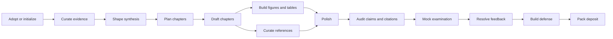

# STORY workflow skills

**Language:** English | [简体中文](writing-workflow-skills.zh-CN.md)

The skills form a master's/doctoral thesis pipeline rather than a rigid sequence. Use the smallest skill that owns the requested artifact.
A fresh clone has no prefilled `notes/*.md` files: each primary output below is created by its owning skill on first use, and downstream skills treat absence as an uninitialized stage.
Before level-specific synthesis, planning, examination, defense, or deposit work, set the author-confirmed `% degree_level: master|doctoral` in `degree/profile.tex`. The same evidence and attribution contract applies in both modes; contribution scope and milestone gates follow the selected level and confirmed institutional rules.

| Skill | Use it when | Primary output |
| --- | --- | --- |
| `story-proj-adopt` | An existing thesis or Overleaf export must enter STORY | `notes/adopt.md` and mapped sources |
| `story-evid-curator` | Evidence must be imported, registered, refreshed, or checked | `mates/` and `mates/MANIFEST.md` |
| `story-syns-coach` | The thesis-level problem, argument, questions, or contributions are unclear | story, contribution, publication, and claim metadata |
| `story-outl-planner` | The research arc must become a chapter plan | `notes/outline.md`, `notes/notation.md`, chapter scaffolds |
| `story-chap-drafter` | One chapter needs drafting or evidence-bound revision | one `manus/chaps/*.tex` file and ledger updates |
| `story-tabs-builder` | A table must be generated from registered evidence | `manus/tabs/*.tex` |
| `story-figs-designer` | A figure and editable source must be planned or built | `manus/figs/` and `manus/figs/srcs/` |
| `story-refs-curator` | A source must be added, verified, read, or positioned | bibliography and `notes/refs/` |
| `story-copy-editor` | Voice, terminology, transitions, or repetition need polishing | manuscript edits, a report, or `notes/style.md` |
| `story-clms-auditor` | Numbers and contribution claims need traceability checks | claim verdicts and tasks |
| `story-cite-auditor` | Citation keys or literature assertions need checking | citation report and tasks |
| `story-exam-reviewer` | The thesis needs a degree-appropriate mock examination | milestone review file |
| `story-revs-resolver` | Supervisor, committee, examiner, or deposit feedback arrived | point ledger, responses, promises |
| `story-defn-builder` | An applicable defense narrative or deck needs preparation | defense plan and deck artifacts |
| `story-depo-packer` | A final package needs preflight and a freeze record | deposit bundle and record |
| `story-flow-status` | The next action is unclear | read-only status summary |

Every skill first reads [writing-workflow-conventions.md](writing-workflow-conventions.md).
