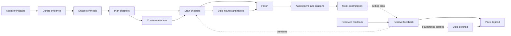

# STORY workflow skills

**Language:** English | [简体中文](writing-workflow-skills.zh-CN.md)

The skills form a master's/doctoral thesis pipeline rather than a rigid sequence. Use the smallest skill that owns the requested artifact.
A fresh clone has no prefilled `notes/*.md` files: each primary output below is created by its owning skill on first use, and downstream skills treat absence as an uninitialized stage.
Before level-specific synthesis, planning, examination, defense, or deposit work, set the author-confirmed `% degree_level: master|doctoral` in `degree/profile.tex`. The same evidence and attribution contract applies in both modes; contribution scope and milestone gates follow the selected level and confirmed institutional rules.

| Skill | Use it when | Primary output |
| --- | --- | --- |
| `story-proj-adopt` † | An existing thesis or Overleaf export must enter STORY | `notes/adopt.md` and mapped sources |
| `story-evid-curator` | Evidence must be imported, registered, refreshed, or checked | `mates/` and `mates/MANIFEST.md` |
| `story-syns-coach` † | The thesis-level problem, argument, questions, or contributions are unclear | story, contribution, publication, and claim metadata |
| `story-outl-planner` † | The research arc must become a chapter plan | `notes/outline.md`, `notes/notation.md`, chapter scaffolds |
| `story-chap-drafter` | One chapter or one front- or back-matter file needs evidence-bound drafting in the thesis and author's voice; `trace` adds source anchors without redrafting | one `manus/chaps/`, `manus/fronts/`, or `manus/backs/` file and ledger updates |
| `story-tabs-builder` | A table must be generated from registered evidence | `manus/tabs/*.tex` |
| `story-figs-designer` | A figure and editable source must be planned or built | `manus/figs/` and `manus/figs/srcs/` |
| `story-refs-curator` | A source must be added, verified, read, or positioned | bibliography and `notes/refs/` |
| `story-copy-editor` | Authorial voice, formulaic prose, terminology, transitions, or repetition need polishing | manuscript edits, a report, or `notes/style.md` |
| `story-clms-auditor` | Numbers and contribution claims need traceability checks | claim verdicts and tasks |
| `story-cite-auditor` | Citation keys or literature assertions need checking | citation report and tasks |
| `story-exam-reviewer` | The thesis needs a degree-appropriate mock examination | `milestones/<slug>/simulations/SIM_EXAM_<date>.md`, or `wkdrs/reports/SIM_EXAM_<date>.md` when no milestone is named or active |
| `story-revs-resolver` † | Supervisor, committee, examiner, or deposit feedback arrived | point ledger, responses, promises |
| `story-defn-builder` † | An applicable defense narrative or deck needs preparation | defense plan and deck artifacts |
| `story-depo-packer` † | A final package needs preflight and a freeze record | deposit bundle and record |
| `story-flow-status` | The next action is unclear | read-only status summary |

Skills marked † are explicit-only: they change thesis-wide structure, milestone handling, or institutional packaging, so they run only when you type them, and no router or goal run starts one ([conventions §9](writing-workflow-conventions.md#9-skill-roster)).

Every skill takes the same argument shape: `<skill> [TARGET] [DESCRIPTION] [involve=<level>]`. `involve=low|medium|high` is stripped first and sets how much this run asks. The target resolves as that skill documents it, and whatever remains is a description: free text that says what this run is for, such as `/story-chap-drafter 3 lead with the ablation, the committee asked for it`. Background in it authorizes nothing; a clear instruction to perform an operation the skill documents authorizes that routine action, but never replaces a confirmation point or an ask-first choice. Its intent and stated limits still steer and bind the run, which never widens the selected mode, target, or scope silently. The full rule is [conventions §7](writing-workflow-conventions.md). Claude Code and Qwen Code show each skill's shape as an `argument-hint` in their own skill menus, and Pi in its `/story-*` prompt templates; the other harnesses do not read that field. Claude Code also runs `story-flow-status` at `effort: medium`, because its scan is read-only; no other skill carries a model or effort setting.

Before doing anything else, every skill reads [writing-workflow-conventions.md](writing-workflow-conventions.md). The skill instructions and the conventions are English only. A run whose language resolves to Chinese follows them, replies in Chinese, and writes new Markdown in Chinese; manuscript prose still follows `degree/profile.tex`.
After a skill completes, its handoff ends with exactly one `Next action:` line naming the owning skill and concrete target or command for the earliest remaining gate; a command recommended at an involve level other than the one `.env` gives spells out its `involve=<level>` token, so it works pasted as printed. If only the author can clear that gate, it names the required author action; if nothing remains, it explicitly says the requested workflow is complete. This recommendation does not authorize another skill to run. A status, audit, or review-only request ends with its report. The one exception is a `story-auto` goal run you type (below), which still never starts a † skill.
Chapter drafting, copy-editing, and mock examination also apply the [human-writing contract](writing-workflow-conventions.md#human-writing-contract) (conventions §5), which adapts Humanizer patterns to evidence-bound academic prose without treating isolated words as proof of AI authorship.

One command stands outside the roster: `story-auto <goal> [involve=<level>]` pursues a stated goal, such as `story-auto chapter 3 drafted and audited`. It runs `story-flow-status` first, then takes the next action each run names, starting the ten unmarked skills itself, one unit of work per start, because typing the command is your decision, made once for the pursuit. At a † skill it stops and prints the exact command; at a gate only you can clear, it stops and names the author action. Confirmation points and the ask-first choices of `AGENTS.md` §1 still come to you at every involve level. It never imports or refreshes evidence, writes `degree/` or received feedback, declares a deposit ready, commits, or pushes, and it never waits for green lint, since open `\todo` markers keep lint red mid-draft. Its level is the `involve=` token you type, else `INVOLVE` in `.env`. Its final report ends with one `Next action:` line like any skill's. Full rule: [conventions §8, Goal runs](writing-workflow-conventions.md#goal-runs); the procedure: [`.agents/commands/story-auto.md`](../../../.agents/commands/story-auto.md).
