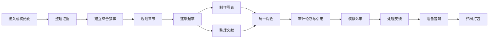

# STORY 工作流 Skills

**语言：** [English](writing-workflow-skills.md) | 简体中文

这些 skill 构成硕士/博士学位论文流水线，但不是僵硬的线性步骤。每次选择拥有目标产物的最小 skill。
新克隆不预置 `notes/*.md`：下表中的主要产物在首次使用时由负责它的 skill 创建，下游 skill 把缺失视为阶段尚未初始化。
在开展层级相关的综合叙事、提纲、审查、答辩或归档工作前，先在 `degree/profile.tex` 中写入经作者确认的 `% degree_level: master|doctoral`。两种模式采用相同的证据与归属契约；贡献范围和里程碑关口按所选层级及已确认学校规则确定。

| Skill | 使用时机 | 主要产物 |
| --- | --- | --- |
| `story-proj-adopt` | 接入已有论文或 Overleaf 导出 | `notes/adopt.md` 与映射后的源文件 |
| `story-evid-curator` | 导入、登记、刷新或检查证据 | `mates/` 与 `mates/MANIFEST.md` |
| `story-syns-coach` | 总问题、中心论点、研究问题或贡献不清楚 | 总叙事、贡献、出版物与论断元数据 |
| `story-outl-planner` | 把研究主线变成章节规划 | `notes/outline.md`、`notes/notation.md` 与章节骨架 |
| `story-chap-drafter` | 以学位论文和作者声音起草或基于证据修改一章 | 一个章节文件与记录表更新 |
| `story-tabs-builder` | 从已登记证据生成表格 | `manus/tabs/*.tex` |
| `story-figs-designer` | 规划或制作图及可编辑源文件 | `manus/figs/` 与 `manus/figs/srcs/` |
| `story-refs-curator` | 添加、核验、阅读或组织文献 | bibliography 与 `notes/refs/` |
| `story-copy-editor` | 统一作者声音，修改公式化表达、术语、过渡或重复 | 正文修改、报告或 `notes/style.md` |
| `story-clms-auditor` | 检查数字和贡献论断的可追溯性 | 论断结论与任务 |
| `story-cite-auditor` | 检查引用键与文献陈述 | 引用报告与任务 |
| `story-exam-reviewer` | 进行适合学位层级的模拟审查 | 里程碑审查文件 |
| `story-revs-resolver` | 导师、委员会、外审或归档反馈到达 | 逐点记录、回复与承诺 |
| `story-defn-builder` | 准备适用的答辩叙事或演示文稿 | 答辩计划与演示产物 |
| `story-depo-packer` | 最终检查、打包并冻结版本 | 归档包与记录 |
| `story-flow-status` | 不清楚下一步做什么 | 只读状态摘要 |

所有 skill 共用同一个参数形状：`<skill> [TARGET] [DESCRIPTION] [involve=<level>]`。`involve=low|medium|high` 最先被剥离，它决定这次运行询问的多少；即使某个 skill 的 `argument-hint` 没有标出它，这一步也不例外。目标按各 skill 自己写明的规则解析，剩下的一切是描述：用自由文本说明这次运行是为了什么，例如 `/story-chap-drafter 3 消融是重点，开篇就摆出来，答辩委员会问到了`。描述是线索而不是命令。完整规则见[规约 §7](writing-workflow-conventions.zh-CN.md)。Claude Code 与 Qwen Code 会在各自的 skill 菜单里把每个 skill 的形状显示为 `argument-hint`；其他 harness 不读取该字段。

开始任何工作前，每个 skill 都先读取 [writing-workflow-conventions.md](writing-workflow-conventions.md)。
skill 完成后，交接报告末尾必须有且仅有一行 `下一步：`，写明负责最早剩余关口的 skill 及具体目标或命令。若只有作者能解除该关口，则写明所需作者行动；若已无剩余工作，则明确说明请求的工作流已完成。这项建议不构成运行另一个 skill 的授权。
章节起草、润色和模拟审查还会应用共享的[学术自然写作指南](human-writing-guide.zh-CN.md)。该指南把 Humanizer 模式改编为受证据约束的学术表达，不会把孤立词语当作 AI 创作的证明。
