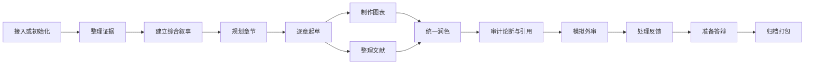

# STORY 工作流 Skills

**语言：** [English](writing-workflow-skills.md) | 简体中文

这些 skill 构成博士论文流水线，但不是僵硬的线性步骤。每次选择拥有目标文件的最小 skill。

| Skill | 使用时机 | 主要产物 |
| --- | --- | --- |
| `story-proj-adopt` | 接入已有论文或 Overleaf 导出 | `notes/adopt.md` 与映射后的源文件 |
| `story-evid-curator` | 导入、登记、刷新或检查证据 | `mates/` 与 `mates/MANIFEST.md` |
| `story-syns-coach` | 总问题、中心论点、研究问题或贡献不清楚 | `notes/story.md`、`notes/contributions.md` |
| `story-outl-planner` | 把研究主线变成章节规划 | `notes/outline.md` 与章节骨架 |
| `story-chap-drafter` | 起草或基于证据修改一章 | 一个章节文件与记录表更新 |
| `story-tabs-builder` | 从已登记证据生成表格 | `manus/tabs/*.tex` |
| `story-figs-designer` | 规划或制作图及可编辑源文件 | `manus/figs/` 与 `manus/figs/srcs/` |
| `story-refs-curator` | 添加、核验、阅读或组织文献 | bibliography 与 `notes/refs/` |
| `story-copy-editor` | 统一声音、术语、过渡或删减重复 | 正文修改与报告 |
| `story-clms-auditor` | 检查数字和贡献论断的可追溯性 | 论断结论与任务 |
| `story-cite-auditor` | 检查引用键与文献陈述 | 引用报告与任务 |
| `story-exam-reviewer` | 进行真实感较强的模拟外审 | 里程碑审查文件 |
| `story-revs-resolver` | 导师、委员会、外审或归档反馈到达 | 逐点记录、回复与承诺 |
| `story-defn-builder` | 准备答辩叙事或演示文稿 | 答辩计划与演示产物 |
| `story-depo-packer` | 最终检查、打包并冻结版本 | 归档包与记录 |
| `story-flow-status` | 不清楚下一步做什么 | 只读状态摘要 |

每个 skill 首先读取 [writing-workflow-conventions.md](writing-workflow-conventions.md)。
