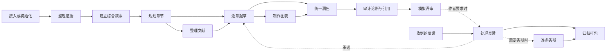

# STORY 工作流 Skills

**语言：** [English](writing-workflow-skills.md) | 简体中文

这些 skill 构成硕士/博士学位论文流水线，但不是僵硬的线性步骤。每次选择拥有目标产物的最小 skill。
新克隆不预置 `notes/*.md`：下表中的主要产物在首次使用时由负责它的 skill 创建，下游 skill 把缺失视为阶段尚未初始化。
在开展层级相关的综合叙事、提纲、评审、答辩或归档工作前，先在 `degree/profile.tex` 中写入经作者确认的 `% degree_level: master|doctoral`。两种模式采用相同的证据与归属契约；贡献范围和里程碑关口按所选层级及已确认学校规则确定。

| Skill | 使用时机 | 主要产物 |
| --- | --- | --- |
| `story-proj-adopt` † | 接入已有论文或 Overleaf 导出 | `notes/adopt.md` 与映射后的源文件 |
| `story-evid-curator` | 导入、登记、刷新或检查证据 | `mates/` 与 `mates/MANIFEST.md` |
| `story-syns-coach` † | 总问题、中心论点、研究问题或贡献不清楚 | 总叙事、贡献、出版物与论断元数据 |
| `story-outl-planner` † | 把研究主线变成章节规划 | `notes/outline.md`、`notes/notation.md` 与章节骨架 |
| `story-chap-drafter` | 以学位论文和作者声音起草或基于证据修改一章或一份前置/后置部分文件；`trace` 只补充来源锚点，不重写正文 | 一个 `manus/chaps/`、`manus/fronts/` 或 `manus/backs/` 文件及同步台账 |
| `story-tabs-builder` | 从已登记证据生成表格 | `manus/tabs/*.tex` |
| `story-figs-designer` | 规划或制作图及可编辑源文件 | `manus/figs/` 与 `manus/figs/srcs/` |
| `story-refs-curator` | 添加、核验、阅读或组织文献 | bibliography 与 `notes/refs/` |
| `story-copy-editor` | 统一作者声音，修改公式化表达、术语、过渡或重复 | 正文修改、报告或 `notes/style.md` |
| `story-clms-auditor` | 检查数字和贡献论断的可追溯性 | 论断结论与任务 |
| `story-cite-auditor` | 检查引用键与文献断言 | 引用报告与任务 |
| `story-exam-reviewer` | 进行适合学位层级的模拟评审 | `miles/<slug>/simulations/SIM_EXAM_<date>.md`；没有指定或当前里程碑时为 `wkdrs/reports/SIM_EXAM_<date>.md` |
| `story-revs-resolver` † | 导师、委员会、评阅人或归档反馈到达 | 逐点记录、回复与承诺 |
| `story-defn-builder` † | 准备适用的答辩叙事或演示文稿 | 答辩计划与演示产物 |
| `story-depo-packer` † | 最终检查、打包并冻结版本 | 归档包与记录 |
| `story-flow-status` | 不清楚下一步做什么 | 只读状态摘要 |

标 † 的 skill 只能显式调用：它们改变论文级结构、里程碑处理或学校归档打包，因此只在你亲手敲下时运行，分流器和目标运行都不会启动它们（[规约 §9](writing-workflow-conventions.md#9-skill-roster)，英文）。

所有 skill 共用同一个参数形状：`<skill> [TARGET] [DESCRIPTION] [involve=<level>]`。`involve=low|medium|high` 最先被剥离，它决定本次运行向你提问的多少。目标按各 skill 自己写明的规则解析，剩下的一切是描述：用自由文本说明这次运行是为了什么，例如 `/story-chap-drafter 3 消融是重点，开篇就摆出来，答辩委员会问到了`。描述中的背景信息不构成授权；要求执行该 skill 已写明操作的清楚指令可以授权这项常规动作，但绝不代替确认点或须先询问的选择。描述的意图与限制仍约束本次运行，运行不得悄悄扩大所选模式、目标或范围。完整规则见[规约 §7](writing-workflow-conventions.md)（英文）。Claude Code 与 Qwen Code 会在各自的 skill 菜单里把每个 skill 的形状显示为 `argument-hint`，Pi 则在其 `/story-*` prompt 模板中显示；其他 harness 不读取该字段。Claude Code 还以 `effort: medium` 运行 `story-flow-status`，因为它的扫描是只读的；其他 skill 都不带模型或 effort 设置。

开始任何工作前，每个 skill 都先读取 [writing-workflow-conventions.md](writing-workflow-conventions.md)。skill 指令和规约只有英文版。语言解析为中文的运行同样遵循它们，用中文回复、用中文撰写新的 Markdown；手稿正文语言仍由 `degree/profile.tex` 决定。
skill 完成后，交接报告末尾必须有且仅有一行 `下一步：`，写明负责最早剩余关口的 skill 及具体目标或命令；若建议的参与度不同于 `.env` 给出的级别，命令会写明 `involve=<level>`，照抄粘贴即可用。若只有作者能解除该关口，则写明所需作者行动；若已无剩余工作，则明确说明请求的工作流已完成。这项建议不构成运行另一个 skill 的授权。状态、审计或只评审的请求在交付报告后结束。唯一的例外是你亲手敲下的 `story-auto` 目标运行（见下），它同样绝不启动标 † 的 skill。
章节起草、润色和模拟评审还会应用[规约 §5](writing-workflow-conventions.md#human-writing-contract) 的学术自然写作契约（human-writing contract，英文）。该契约把 Humanizer 模式改编为受证据约束的学术表达，不会把孤立词语当作 AI 创作的证明。

名册之外还有一条命令：`story-auto <目标> [involve=<level>]` 朝给定目标推进，例如 `story-auto 第 3 章起草完成并通过审计`。它先运行 `story-flow-status`，然后接着执行每次运行点名的下一步，自行启动未标记的十个 skill，每次启动只做一个工作单元，因为敲下这条命令就是你的决定，为整场推进一次做出。遇到标 † 的 skill，它停下并打印准确命令；遇到只有你能解除的关口，它停下并写明所需作者行动。确认点和 `AGENTS.md` §1 规定须先询问的选择，在任何参与度下仍交给你决定。它绝不导入或刷新证据，不写 `degree/` 或收到的反馈，不宣布归档就绪，不提交也不推送；它也绝不等待 lint 变绿，因为起草中途未解决的 `\todo` 本来就让 lint 保持红色。参与度取你敲下的 `involve=` token，否则取 `.env` 中的 `INVOLVE`。它的最终报告与任何 skill 一样，以一行 `下一步：` 结尾。完整规则见[规约 §8 Goal runs](writing-workflow-conventions.md#goal-runs)（英文）；流程见 [`.agents/commands/story-auto.md`](../../../.agents/commands/story-auto.md)（英文）。
